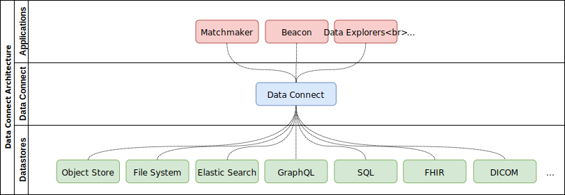

# GA4GH Search <a href="https://github.com/ga4gh-discovery/ga4gh-search/blob/develop/spec/search-api.yaml"></a> [](https://travis-ci.org/ga4gh-discovery/ga4gh-search) [](https://raw.githubusercontent.com/ga4gh-discovery/ga4gh-search/develop/LICENSE)

GA4GH Search is an API specification for a simple, uniform mechanism to publish, discover, query and retrieve the biomedical data that is a companion to the data objects available through other GA4GH APIs. The data expected to be made available through Search are those typically used to filter subjects, sample and files, and by which data scientists make meaningful comparisons across genomic data files. The data that can be handled in Search are what are frequently termed 'metadata'. Search leaves the specific definition of those data to the appropriate scientific specializations, and accomodates the standards, such as SchemaBlocks and FHIR, in which they are expressed. 

GA4GH Search is a standard for searching biomedical data developed by the [Discovery Work Stream](https://github.com/ga4gh-discovery/ga4gh-discovery.github.io) of the [Global Alliance for Genomics & Health](http://ga4gh.org).


## Table of Contents

- [Summary](#summary)
- [Purpose and Motivation](#purpose-and-motivation)
- [Background](#background)
- [Intended Audience](#intended-audience)
- [Specification](#specification)
- [Benefits](#benefits)
- [Use cases](#use-cases)
- [Applications](#applications)
- [Out of scope](#out-of-scope)
- [Implementations](#implementations)
  - [Tables-in-a-bucket (no-code implementation)](#tables-in-a-bucket-no-code-implementation)
  - [Google Sheets implementation](#google-sheets-implementation)
  - [Implementation based on PrestoSQL](#implementation-based-on-prestosql)
- [Security](#security)
- [CORS](#cors)
- [Contributing](#contributing)
- [Testing](#testing)
- [Reporting Security Issues](#reporting-security-issues)

## Summary

The Search API is composed of two principal components: a **Table Discovery API** that exposes table listings and descriptions of available data tables, and a **Query API** that supports SQL queries over those data. It is intentionally general-purpose and minimal. It does not prescribe a particular backend implementation or a data model, and supports federation by design. A focus on tables means users work with a paradigm familiar to them and on which the analysis tools they use are commonly based. A commonly used example of this paradigm is the dataframe in tools such as R and Python data analysis. The tabular approach still allows for nested data structures within it.

## Illustrative use cases

Specific use cases provided in support of a low-level API such as GA4GH Search may belie its general applicability. Nevertheless, specific use cases illustrate its application.

One example would be a researcher who has learned about the COPDGene dataset from dbGaP. They have determined the dataset is relevant to an analysis they are conducting, but the data is previously unseen by the researcher. GA4GH Search would enable the pre-existing schema of the subject phenotype and sample attribute data, provided by the submitters of the COPDGene dataset, to be made available to that researcher in a way that they can understand what data is available, its format and structure. The researcher would work via an interface that is driven by the machine readable schema in the standard form provided by GA4GH Search. Additionally, the schema is provided in a way that allows the researcher to make use of semantic mappinng and transformational tools that will reduce the time they need to spend manipulating the data before analysis. 

Similarly this [pancreatic cancer dataset](https://www.ebi.ac.uk/ega/datasets/EGAD00001003153) in EGA can be described via the same standard way allowing a data scientist to combine it with data from other sources. 

Both use cases above have been explored within the example implementations of GA4GH Search. 


## Purpose and Motivation

Ever advancing biomedical techniques, such as next-generation genome sequencing, multiplex imaging, single cell techniques and others are creating data with novel and unique structure. While standardization within scientific and clinical disciplines is ongoing, the diversity of those disciplines and specializtions will remain with us. As researchers and clinicians accumulate, analyze and attempt to interpret what these data can tell them comes the challenge of exploring and understanding this diversity.

In this specification, we offer a simple, uniform mechanism to publish, discover, query, and analyze any format of biomedical data. There are thousands of ways data can be stored or moved over the network. Any “rectangular” data that fits into rows & columns can be represented via GA4GH Search. This is useful for all kinds of data as we now have a common way to use the information regardless of the domain where it originated.


## Background

The GA4GH has previously developed two standards for discovery. `Beacon` is a standard for  discovery of genomic variants, while `Matchmaker` is a standard for discovery of subjects with certain genomic and phenotypic features. Implementations of these standards have been linked into federated networks ([Beacon Network](http//beacon-network.org) and [Matchmaker Exchange](http://matchmakerexchange.org), respectively). 

Each standard (and corresponding network) has been successful in its own right. It was acknowledged that it would be broadly useful to develop standards that abstracted common utilities for building searchable, federated networks for a variety of applications in genomics and health.

The Discovery Work Stream develops GA4GH Search as a general-purpose framework for building federatable search-based applications.


## Intended Audience

The intended audience of this standard includes:
- Data custodians looking to make their data discoverable and searchable, especially in a federated way. 
- Data consumers looking to discover and search data in an interoperable way, incl. outside of genomics community.
- Developers of applications, such as data explorers.
- API developers within and outside GA4GH looking to incorporate search functionality in their APIs.
- Data model developers within and outside of GA4GH looking to make their data models searchable and interoperable with other standards.


## Specification

The specification is described in [SEARCHSPEC.md](SEARCHSPEC.md). The API is further specified in OpenAPI format in [search-api.yaml](./spec/search-api.yaml), which [can be viewed with Swagger Editor](https://editor.swagger.io/?url=https://raw.githubusercontent.com/ga4gh-discovery/ga4gh-search/develop/spec/search-api.yaml).


## Benefits

- Simple, interoperable, uniform mechanism to publish, discover, query, and analyze biomedical data.
- Flexibility. Works with any “rectangular” data that fits into rows and columns. Does not prescribe a data model and as such, allows custodians to make their data available without extensive ETL transformations.
- Supports federation. Serves as a general-purpose framework for building federatable search-based applications across multiple implementations. Federations reference common schemas and properties.
- Minimal by design. The API is purposely kept minimal so that the barriers to publishing existing data are as small as possible.
- Backend agnostic. It is possible to implement the API across a large variety of backend datastores.
- General purpose. Admits use cases that have not yet been thought of.


## Use cases

Sample use cases include:

- Find subjects with HP:0001519 and candidate gene FBN1 (use case of [Matchmaker Exchange](https://www.matchmakerexchange.org/))
- Find male subjects with HP:0009726 consented for General Research Use (use case of [European Genome-phenome Archive](https://www.ebi.ac.uk/ega/home))
- Find adult males diagnosed with autism having a harmful mutation in SHANK1 (use case of [Autism Sharing Initiative](http://autismsharinginitiative.org))
- Find dataset from subject on European data center hosted on Amazon (use case of [Cloud Work Stream](https://github.com/ga4gh/wiki/wiki))

Full summary of use cases can be found in [USECASES.md](USECASES.md).


## Applications

Various applications can be built on top of GA4GH Search, such as

- Data and metadata indexers
- Query tools
- Data federations
- Concept cross-references
- Parameters for batch workflows
- Workflow result summaries
- Patient matchmaking
- (Most importantly) Things we haven’t yet imagined!


## Out of scope
- Developing data models. GA4GH Search **does not** define data models. It defers that effort to others in the GA4GH or outside implementers.
- Application development. GA4GH Search **does not** prescribe a specific application. It is intentionally general-purpose. It defers to other efforts in the Discovery Work Stream, GA4GH, and beyond to build domain-specific applications.
- Search does not pre-suppose or require that the sources made available through it are harmonized to a given standard. The specification recognizes that aggregating data from non-harmonized sources will:
  - Remain a challenge for data consumers
  - Need to be specfic to purpose
  - Be subject to different and evolving computational approaches. These are best conducted as part of post-Search analysis.
  - Require Search to provide the semantic metadata that enables mapping. Illustrative examples will be provided. 


## Implementations

Architecture of a GA4GH Search system:


<!--
    To edit this image, load assets/ga4gh-search.xml into draw.io and regenerate svg
-->

Sample implementations:

- [Tables-in-a-bucket (no-code implementation)](#dataset-in-a-bucket-no-code-implementation)
- [Google Sheets implementation](#google-sheets-implementation)
- [Implementation based on PrestoSQL](#implementation-based-on-prestosql)

### Tables-in-a-bucket (no-code implementation)
The specification allows for a no-code implementation as a collection of files served statically (e.g. in a cloud bucket, or a Git repository). To do this, you need the following JSON files:

- ```tables```: served in response to ```GET /tables```
- ```table/{table_name}/info```: served in response to ```GET /table/{table_name}/info```.  e.g. a table with the name ```mytable``` should have a corresponding file ```table/mytable/info```
- ```table/{table_name}/data```: served in response to ```GET /table/{table_name}/data```.  e.g. a table with the name ```mytable``` should have a corresponding file ```table/mytable/data```
- ```table/{table_name}/data_{pageNumber}```, which will be linked in the next_page_url of the first table  (e.g. ```mytable```).
- ```table/{table_name}/data_models/{schemaFile}```: Though not required, data models may be linked via [$ref](https://json-schema.org/latest/json-schema-core.html#rfc.section.8.3). Data models can also be stored as static JSON documents, and be referred to by relative or absolute URLs.

A concrete, example test implementation is available [here](https://storage.googleapis.com/ga4gh-tables-example/tables).

### Google Sheets implementation
A Google Sheets spreadsheet can also be exposed via the Tables API using the sheets adapter, located [here](https://github.com/DNAstack/ga4gh-search-adapter-google-sheets).

### Implementation based on PrestoSQL

DNAstack has provided an [implementation of GA4GH Search](https://github.com/dnastack/ga4gh-search-adapter-presto) on top of [PrestoSQL](https://prestosql.io/). This implementation includes examples of data stored in FHIR and Phenopackets formats.


## Security

Sensitive information transmitted over public networks, such as access tokens and human genomic data, MUST be protected using Transport Level Security (TLS) version 1.2 or later, as specified in [RFC 5246](https://tools.ietf.org/html/rfc5246).

If the data holder requires client authentication and/or authorization, then the client’s HTTPS API request MUST present an OAuth 2.0 bearer access token as specified in [RFC 6750](https://tools.ietf.org/html/rfc6750), in the `Authorization` request header field with the Bearer authentication scheme:

```
Authorization: Bearer [access_token]
```

The policies and processes used to perform user authentication and authorization, and the means through which access tokens are issued, are beyond the scope of this API specification. GA4GH recommends the use of the [OpenID Connect](https://openid.net/connect/) and [OAuth 2.0 framework (RFC 6749)](https://tools.ietf.org/html/rfc6749) for authentication and authorization.


## CORS
Cross-origin resource sharing (CORS) is an essential technique used to overcome the same origin content policy seen in browsers. This policy restricts a webpage from making a request to another website and leaking potentially sensitive information. However the same origin policy is a barrier to using open APIs. GA4GH open API implementers should enable CORS to an acceptable level as defined by their internal policy. For any public API implementations should allow requests from any server.

GA4GH published a [CORS best practices document](https://docs.google.com/document/d/1Ifiik9afTO-CEpWGKEZ5TlixQ6tiKcvug4XLd9GNcqo/edit?usp=sharing), which implementers should refer to for guidance when enabling CORS on public API instances.


## Contributing

The GA4GH is an open community that strives for inclusivity. Guidelines for contributing to this repository are listed in [CONTRIBUTING.md](CONTRIBUTING.md). Teleconferences and corresponding [meeting minutes](https://docs.google.com/document/d/1sG--PPVlVWb1-_ZN7cHta79uU9tU2y-17U11PYzvMu8/edit#heading=h.lwhinfkfmlx4) are open to the public. To learn how to contribute to this effort, please email Rishi Nag (rishi.nag@ga4gh.org). 


## Testing

Use [Swagger Validator Badge](https://github.com/swagger-api/validator-badge) to validate the YAML file, or its [OAS Validator](https://github.com/mcupak/oas-validator) wrapper.


## Reporting Security Issues

Please send an email to security-notification@ga4gh.org.
