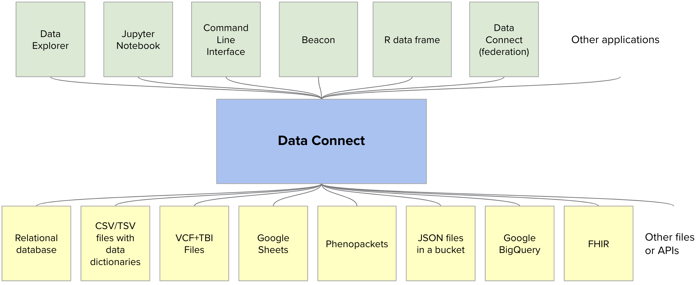

# Data Connect API [](https://github.com/ga4gh-discovery/data-connect/blob/develop/SPEC.md) <a href="https://github.com/ga4gh-discovery/data-connect/blob/develop/spec/api.yaml"></a> [](https://ga4gh-discovery.github.io/data-connect/)  [](https://travis-ci.com/ga4gh-discovery/data-connect) [](https://raw.githubusercontent.com/ga4gh-discovery/data-connect/develop/LICENSE)

Data Connect is a standard for discovery and search of biomedical data, developed by the [Discovery Work Stream](https://github.com/ga4gh-discovery/ga4gh-discovery.github.io) of the [Global Alliance for Genomics & Health](http://ga4gh.org). 

The standard provides a mechanism for:

- Describing data and its data model.
  - Data Connect's _Table API_ component provides a way to organize data into "Tables" and describe their data model, leveraging the JSON Schema standard.
- Searching the data with the given data model.
  - Data Connect's _Search API_ component provides a way to query "Tables" of data, leveraging the SQL standard.

It is **not** in the scope of the standard to:

- Define said data models.
  - Data Connect relies on other efforts in GA4GH (e.g. [GA4GH SchemaBlocks](https://schemablocks.org/)), as well as outside implementers.

For more information:

- Read the [full specification](SPEC.md).
- Explore the [API](spec/api.yaml) (view in [Swagger Editor](https://editor.swagger.io/?url=https://raw.githubusercontent.com/ga4gh-discovery/data-connect/develop/spec/api.yaml)).
- See [documentation for adopters](https://ga4gh-discovery.github.io/data-connect/).


## Background

GA4GH has previously developed two standards for discovery. `Beacon` is a standard for discovery of genomic variants, while `Matchmaker` is a standard for discovery of subjects with certain genomic and phenotypic features. Implementations of these standards have been linked into federated networks (e.g. [Beacon Network](https://beacon-network.org/) and [Matchmaker Exchange](http://matchmakerexchange.org)). 

Both standards (and the corresponding networks) have been successful in their own right, but had a lot in common. It was acknowledged that it would be broadly useful to develop standards that abstract common infrastructure for building searchable, federated networks for a variety of applications in genomics and health.

Data Connect, formerly known as _GA4GH Search_, is this general-purpose middleware for building federated, search-based applications. The name of the API reflects its purpose of:

- Giving data providers a mechanism to enable others to connect to their data via the described data models.
- Allowing data consumers to make connections within the data through a flexible query language.

## Benefits

- **Interoperable**. Simple, interoperable, uniform mechanism to publish, discover, and search biomedical data.
- **Flexible**. Works with any data that can be serialized as an array of JSON objects. Recommends the use of [GA4GH SchemaBlocks](https://schemablocks.org/) data models, but allows custodians to specify their own data models to make their data available without extensive ETL transformations.
- **Supports federation**. Serves as a general-purpose framework for building federatable search-based applications across multiple implementations. Federations reference common schemas and properties.
- **Minimal by design**. The API is purposely kept minimal so that the barriers to publishing existing data are as small as possible.
- **Backend agnostic**. It is possible to implement the API across a large variety of backend datastores.
- **General purpose**. Admits use cases that have not yet been thought of.

## Intended Audience

The intended audience of this standard includes:

- Data custodians looking to make their data discoverable and searchable, especially in a federated way.
- Data consumers looking to discover and search data in an interoperable way, including outside of the genomics community.
- Developers of applications, such as data explorers.
- API developers looking to incorporate search functionality into their APIs.
- Data model developers looking to make their data models searchable and interoperable with other standards.

## Use cases

Data Connect is an intentionally general-purpose middleware meant to enable the development of a diverse ecosystem of applications.



The community has built versions of the following applications on top of Data Connect:

- Data Explorers
- Beacons
- Patient matchmaking
- Jupyter notebooks
- R data frames
- Command line query tools
- Data and metadata indexers
- Data federations
- Concept cross-references

We're looking forward to seeing things we haven’t yet imagined!

The community has also connected data through the following data sources:

- FHIR
- Relational databases
- CSV/TSV files with data dictionaries
- VCF+TBI files
- Phenopackets
- Google BigQuery
- Google Sheets
- and more!

Examples of queries on the data that can be answered via Data Connect include:

- Find subjects with HP:0001519 and candidate gene FBN1 (use case of [Matchmaker Exchange](https://www.matchmakerexchange.org/))
- Find male subjects with HP:0009726 consented for General Research Use (use case of [European Genome-phenome Archive](https://ega-archive.org/))
- Find adult males diagnosed with autism having a harmful mutation in SHANK1 (use case of [Autism Sharing Initiative](http://autismsharinginitiative.org))
- Find dataset from subject on European data center hosted on Amazon (use case of [Cloud Work Stream](https://github.com/ga4gh/wiki/wiki))

Full summary of use cases can be found in [USECASES.md](USECASES.md).

## Implementations

### Server implementations

Several open-source implementations are available:

- [Tables-in-a-bucket (no-code implementation)](#tables-in-a-bucket-no-code-implementation)
- [Google Sheets implementation](#google-sheets-implementation)
- [Implementation based on Trino](#implementation-based-on-trino)

#### Tables-in-a-bucket (no-code implementation)
The specification allows for a no-code implementation as a collection of files served statically (e.g. in a cloud bucket or a Git repository). To do this, you need the following JSON files:

- ```tables```: served in response to ```GET /tables```
- ```table/{table_name}/info```: served in response to ```GET /table/{table_name}/info```.  e.g. a table with the name ```mytable``` should have a corresponding file ```table/mytable/info```
- ```table/{table_name}/data```: served in response to ```GET /table/{table_name}/data```.  e.g. a table with the name ```mytable``` should have a corresponding file ```table/mytable/data```
- ```table/{table_name}/data_{pageNumber}```, which will be linked in the `next_page_url` of the first table  (e.g. ```mytable```).
  - The above is just an illustrative example. Data Connect clients are capable of following any absolute or relative URL.
  - The first page has to be called `/table/{table_name}/data`, then you can use any naming scheme you like for subsequent pages.
  - All the nitty-gritty details of pagination are detailed in [the specification](SPEC.md#pagination-and-long-running-queries).
- ```table/{table_name}/data_models/{schemaFile}```
  - Though not required, data models may be linked via [$ref](https://json-schema.org/latest/json-schema-core.html#rfc.section.8.3).
  - Data models can also be stored anywhere as static JSON documents, and like data pages, can be referred to by relative or absolute URLs.

A concrete, example test implementation is available [here](https://storage.googleapis.com/ga4gh-tables-example/tables).

#### Google Sheets implementation
A Google Sheets spreadsheet can also be exposed via the Tables API using the sheets adapter, located [here](https://github.com/DNAstack/ga4gh-search-adapter-google-sheets).

#### Implementation based on Trino

DNAstack has provided an [implementation of Data Connect](https://github.com/dnastack/ga4gh-search-adapter-presto) on top of [Trino](https://trino.io/). This implementation includes examples of data stored in the FHIR and Phenopackets formats.

### Client implementations

[Several open-source implementations](https://ga4gh-discovery.github.io/data-connect/docs/getting-started/consume-data/) based on different technology stacks are available:
- Python 
- R
- CLI

## Security

Sensitive information transmitted over public networks, such as access tokens and human genomic data, MUST be protected using Transport Level Security (TLS) version 1.2 or later, as specified in [RFC 5246](https://tools.ietf.org/html/rfc5246).

If the data holder requires client authentication and/or authorization, then the client’s HTTPS API request MUST present an OAuth 2.0 bearer access token as specified in [RFC 6750](https://tools.ietf.org/html/rfc6750), in the `Authorization` request header field with the Bearer authentication scheme:

```
Authorization: Bearer [access_token]
```

The policies and processes used to perform user authentication and authorization, and the means through which access tokens are issued, are beyond the scope of this API specification. GA4GH recommends the use of the [OpenID Connect](https://openid.net/connect/) and [OAuth 2.0 framework (RFC 6749)](https://tools.ietf.org/html/rfc6749) for authentication and authorization.

A stand-alone security review has been performed on the API. Nevertheless, GA4GH cannot guarantee the security of any implementation to which the API documentation links. If you integrate this code into your application it is AT YOUR OWN RISK AND RESPONSIBILITY to arrange for an audit to ensure compliance with any applicable regulatory and security requirements, especially where personal data may be at issue.

To report security issues with the specification, please send an email to [security-notification@ga4gh.org](mailto:security-notification@ga4gh.org).

## CORS
Cross-origin resource sharing (CORS) is an essential technique used to overcome the same origin content policy seen in browsers. This policy restricts a webpage from making a request to another website and leaking potentially sensitive information. However the same origin policy is a barrier to using open APIs. GA4GH open API implementers should enable CORS to an acceptable level as defined by their internal policy. All public API implementations should allow requests from any server.

GA4GH has provided a [CORS best practices document](https://docs.google.com/document/d/1Ifiik9afTO-CEpWGKEZ5TlixQ6tiKcvug4XLd9GNcqo/edit?usp=sharing), which implementers should refer to for guidance when enabling CORS on public API instances.

## Development

### Validating

The API is specified in OpenAPI 3. Use [Swagger Validator Badge](https://github.com/swagger-api/validator-badge) to validate the YAML file, or its [OAS Validator](https://github.com/mcupak/oas-validator) wrapper.

### Documentation
Documentation is sourced from the `hugo/` directory. Building the docs requires the [Hugo framework](https://gohugo.io/documentation/) with the [Clyde theme](https://github.com/DNAstack/clyde). Edit the markdown files under `hugo/content/` for content changes.

Run the docs locally using `make run`, which is served at `http://localhost:1313/data-connect/`. Clean up before commiting using `make clean`. 

To manually inspect the build artifacts, use `make build`. Clean up before commiting using `make clean`.

### Contributing

The GA4GH is an open community that strives for inclusivity. Guidelines for contributing to this repository are listed in [CONTRIBUTING.md](CONTRIBUTING.md). Teleconferences and corresponding [meeting minutes](https://w3id.org/ga4gh/minutes/discovery-search) are open to the public. To learn how to contribute to this effort, please [contact us](mailto:info@ga4gh.org). 
