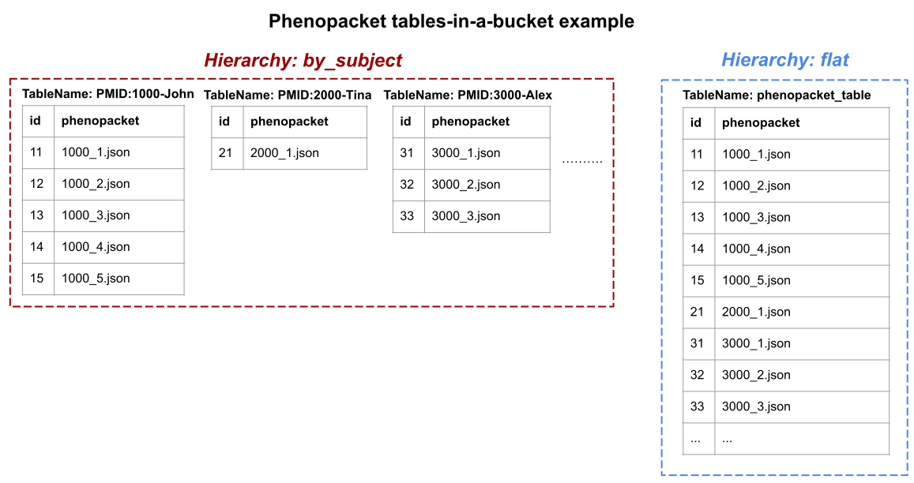

# Discovery Search Specification

- [Introduction](#introduction)
  * [Intended Audience](#intended-audience)
  * [Purpose and Motivation](#purpose-and-motivation)
  * [Traits](#traits)
  * [Applications](#applications)
- [Specification](#specification)
  * [Overview](#overview)
  * [Discovery and Browsing](#discovery-and-browsing)
    + [Discovery and Browsing Examples](#discovery-and-browsing-examples)
  * [Query](#query)
    + [Query Example](#query-example)
      - [Query Request](#query-request)
      - [Query Result](#query-result)
    + [Correspondence Between SQL and JSON Data Types](#correspondence-between-sql-and-json-data-types)
  * [Semantic Data Types](#semantic-data-types)
    + [Example: Semantic Data Types on a Table](#example--semantic-data-types-on-a-table)
    + [Attaching Semantic Data Types To Query Results](#attaching-semantic-data-types-to-query-results)
    + [Example: Semantic Data Types in Query Results](#example--semantic-data-types-in-query-results)
  * [SQL Functions (WIP)](#sql-functions--wip-)
  * [Dealing with Long Running Queries (WIP)](#dealing-with-long-running-queries--wip-)
- [Supplementary Information](#supplementary-information)
  * [Interop with other data storage and transmission standards](#interop-with-other-data-storage-and-transmission-standards)
    + [Phenopackets](#phenopackets)
      - [Concrete Example](#concrete-example)
      - [Organizing Into Tables](#organizing-into-tables)
    + [Portable Format for Biomedical Data (PFB)](#portable-format-for-biomedical-data--pfb-)
    + [DICOM](#dicom)
    + [HL7/FHIR](#hl7-fhir)
  * [How to Secure Implementations Based on Presto Connectors or PostgreSQL Foreign Data Wrappers](#how-to-secure-implementations-based-on-presto-connectors-or-postgresql-foreign-data-wrappers)
  * [Implementing a Federation of SQL Query Nodes](#implementing-a-federation-of-sql-query-nodes)
- [Appendix A: SQL Grammar](#appendix-a--sql-grammar)

## Introduction


### Intended Audience

The intended audience of this specification includes both data providers and data consumers who are implementers of the specification. Data custodians can implement to make their biomedical data more discoverable.


### Purpose and Motivation 

The ever growing new biomedical techniques, such as next-generation genome sequencing, imaging, and others are creating vast amounts of data. Everyday researchers and clinicians accumulate and analyze the world's exponentially growing volumes of genomic and clinical data. With this large data comes the challenge for exploring and finding the data, while interpreting various available formats.

In this specification, we offer a simple, uniform mechanism to publish, discover, query, and analyze any format of biomedical data. There are thousands of ways data can be stored or moved over the network. Any “rectangular” data that fits into rows & columns can be represented via the Search API. This is useful for all kinds of data as we now have a common way to use the information regardless of the way it was collected. 

Search API enables an ecosystem of compatible tools and components that search genotypic and phenotypic data. This document describes the overall structure of the Search API and specifies how a Search API implementation should parse, execute, and respond to a query expressed in the SQL language. Independently developed implementations that conform to this specification can be used interchangeably by a client, or networked together into a tree-structured federation of search nodes.


### Traits

The Search API was designed with the following constraints in mind:

*   Supports Federation: Search API serves as a general-purpose framework for building federatable search-based applications across multiple implementations. Federations of the search framework reference common schemas and properties.
*   General: Admits use cases that have not yet been thought of
*   Minimal: Search API is purposely kept minimal so that the barriers to publishing existing data are as small as possible. 
*   Backend Agnostic: This property makes it possible to implement the framework across a large variety of backend datastores.


### Applications

Various applications can be built on top of Search API implementations such as

*   Data and metadata indexers
*   Query tools
*   Data federations
*   Concept cross-references
*   Parameters for batch workflows
*   Workflow result summaries
*   Patient matchmaking
*   (Most importantly) Things we haven’t yet imagined!


## Specification


### Overview

The primary container for data in the Search API is the **Table**. Tables contain rows of data, where each row is a JSON object with key/value pairs. The table describes the structure of its row objects using [JSON Schema](https://json-schema.org/). Row attributes can take on any legal JSON value, eg. numbers, strings, booleans, nulls, arrays, and nested JSON objects.

The API supports browsing and discovery of data models and table metadata, listing table data, and optionally querying table data using arbitrarily complex expressions including joins and aggregations. The query language is SQL with domain specific functions to facilitate informative typing of the result fields. 

All discovery, browsing and query operations are specified formally in the [OpenAPI specification](https://github.com/ga4gh-discovery/ga4gh-discovery-search/blob/develop/spec/search-api.yaml) document.


### Discovery and Browsing

The Discovery and Browsing part of the Search API consists of the following REST operations:


<table>
  <tr>
   <td>GET /tables
   </td>
   <td>Retrieve a paginated list of tables available from this Search API instance
   </td>
  </tr>
  <tr>
   <td>GET /table/{id}/info[^1]
   </td>
   <td>Retrieve the data model associated with the given table
   </td>
  </tr>
  <tr>
   <td>GET /table/{id}/data
   </td>
   <td>Retrieve the data model and data rows (paginated) from the given table
   </td>
  </tr>
</table>


#### Discovery and Browsing Examples


```
GET /tables
```
```
{
  "tables": [
    {
      "name": "search_cloud.brca_exchange.v32",
      "data_model": {
        "$ref": "https://ga4gh-search-adapter-presto-public.staging.dnastack.com/table/search_cloud.brca_exchange.v32/info"
      }
    },
    {
      "name": "search_postgres_pgpc.ontology.axiom",
      "data_model": {
        "$ref":     "https://ga4gh-search-adapter-presto-public.staging.dnastack.com/table/search_postgres_pgpc.ontology.axiom/info"
        }
    },
    ...
    ...
  ],
  "pagination": {
    "next_page_url": "https://ga4gh-search-adapter-presto-public.staging.dnastack.com/tables/catalog/search_drs"
  }
}
```

```
GET `/table/search_postgres_pgpc.ontology.axiom/info`
```
```
{
  "name": "search_postgres_pgpc.ontology.axiom",
  "data_model": {
    "$id": "https://ga4gh-search-adapter-presto-public.staging.dnastack.com/table/search_postgres_pgpc.ontology.axiom/info",
    "description": "Automatically generated schema",
    "$schema": "http://json-schema.org/draft-07/schema#",
    "properties": {
      "ontology": {
        "format": "varchar",
        "type": "string",
      },
      "ontology_version": {
        "format": "varchar",
        "type": "string",
      },
      "from_term": {
        "format": "varchar",
        "type": "string",
      },
      "relation": {
        "format": "varchar",
        "type": "string",
      },
      "to_term": {
        "format": "varchar",
        "type": "string",
      }
    }
  }
}
```


```
GET /table/`search_postgres_pgpc`.ontology.axiom/data
```
```
{
  "data_model": { <described in the /info example above> },
  "data": [
    {
      "ontology": "http://purl.obolibrary.org/obo/hp.owl",
      "ontology_version": "http://purl.obolibrary.org/obo/hp/releases/2019-04-15",
      "from_term": "HP_0100572",
      "relation": "SubClassOf",
      "to_term": "HP_0100571"
    },
    {
      "ontology": "http://purl.obolibrary.org/obo/hp.owl",
      "ontology_version": "http://purl.obolibrary.org/obo/hp/releases/2019-04-15",
      "from_term": "UBERON_0005047",
      "relation": "SubClassOf",
      "to_term": "UBERON_0001824"
    },
    ...
    ...
  ],
  "pagination": {
    "next_page_url": "https://ga4gh-search-adapter-presto-public.staging.dnastack.com/search/v1/statement/executing/20200901_013328_00039_szpff/y4134d1e51a8262d0f8fed899b2eed9fd02e200e9/1"
}
```

### Query

The Query part of the Search API consists of the following REST operation:

```
<table>
  <tr>
   <td>POST /search
   </td>
   <td>Executes the given SQL query and returns the results as a Table
   </td>
  </tr>
</table>
```


#### Query Example


##### Query Request

Here is a concrete example of a search query against a search implementation.

```
POST Request:
/search

Header:
content-type: application/json

Request body:
{ "query": "SELECT * from search_postgres_pgpc.ontology.axiom WHERE to_term='UBERON_0000464'"}
```

##### Query Result

The result is returned in the same data structure as tables are returned by the discovery and browsing part of the Search API: a **TableData** object.

```

{
  "data_model": { <described in the /info example above> },
  "data": [
    {
      "ontology": "http://purl.obolibrary.org/obo/hp.owl",
      "ontology_version": "http://purl.obolibrary.org/obo/hp/releases/2019-04-15",
      "from_term": "UBERON_0009572",
      "relation": "SubClassOf",
      "to_term": "UBERON_0000464"
    },
    {
      "ontology": "http://purl.obolibrary.org/obo/hp.owl",
      "ontology_version": "http://purl.obolibrary.org/obo/hp/releases/2019-04-15",
      "from_term": "UBERON_0009670",
      "relation": "SubClassOf",
      "to_term": "UBERON_0000464"
    },
    ...
    ...
  ],
  "pagination": {
    "next_page_url": "https://ga4gh-search-adapter-presto-public.staging.dnastack.com/search/v1/statement/executing/20200831_235126_36756_szpff/yf9a38c74873e654f04309fe956cb40c8fb2d022f/1"
  }
}

```
#### Correspondence Between SQL and JSON Data Types

Data is manipulated in the query using the following types. Each SQL type is expressed as a physical JSON value in the response table. Semantic types (defined by JSON Schema reference URLs) are covered in the next section.

| SQL Type                      | JSON Type                                                    | Example Values                                               |
| ----------------------------- | ------------------------------------------------------------ | ------------------------------------------------------------ |
| boolean                       | boolean                                                      | true false                                                   |
| tinyint, smallint, integer    | number                                                       | 123 -7000                                                    |
| real, double                  | number                                                       | 123.456 7.445e-17                                            |
| decimal, bigint               | string                                                       | "12345.678910"                                               |
| varchar, char                 | string                                                       | "Hello world"                                                |
| JSON                          | Same JSON type (object, array, string, number, boolean, or null) | { "k1": "v1", "k2": false }[ 1, 3, 5, "seven", [ 1 ] ] "Hello JSON" 123.456 false null |
| date                          | string in ISO 8601 format                                    | "2020-05-27"                                                 |
| time [without time zone]      | string in ISO 8601 format                                    | "12:22:27.000"                                               |
| time with time zone           | string in ISO 8601 format                                    | "12:22:27.000Z" "12:22:27.000-03:00"                         |
| timestamp [without time zone] | string in ISO 8601 format                                    | "2020-05-27T12:22:27.000"                                    |
| timestamp with time zone      | string in ISO 8601 format                                    | "2020-05-27T12:22:27.000Z" "2020-05-27T12:22:27.000-05:00"   |
| interval day to month         | String in ISO 8601 period format                             | "P3Y2M"                                                      |
| interval day to second        | String in ISO 8601 duration format                           | "P3DT4H3M2S" "PT3M2S" "PT4H3M"                               |
| array                         | array                                                        | [ 1, 3, 5, "seven", [ 1 ] ]                                  |
| map                           | object                                                       | { "key": "value” }                                           |
| row                           | object                                                       | { "colname": "colvalue” }                                    |

### Semantic Data Types

To enable discovery of tables based on the kind of information contained within them, and to enable query tools to offer to filter and join data from different sources in a sensible way, tables need to declare not only the physical type of their rows (eg. how data is represented as JSON) but also the semantic type (what the data means). This means that any datasource which can conform to this requirement, may be exposed as a Table.

The Search API describes the _meaning_ of data through JSON Schema references ($ref). Clients can discover that attributes in different tables refer to the same concept as each other by examining the target of each attribute’s JSON Schema reference. If the $ref URLs are the same, then the client knows that the attributes have the same meaning.

Clients can use the attribute meanings to:

*   Recommend joining to tables that contain similar types of information
*   Display table attributes in a meaningful way
*   Construct queries across tables in an informed way which retains the underlying meaning of the data, or create new meaning

This system of identifying types through reference URLs is amenable to building up cross-references. With a rich set of cross references, a Search API client can help join up data from sources that use different nomenclatures.


#### Example: Semantic Data Types on a Table 

Assume the following JSON Schema is published at https://schemablocks.org/schemas/example/blood-group/v1.0.0/BloodGroup.json:

```
{
  "$schema": "http://json-schema.org/draft-07/schema#",
  "$id": "https://schemablocks.org/schemas/example/blood-group/v1.0.0",
  "properties": {
    "abo_blood_group": {
      "$ref": "https://schemablocks.org/schemas/sb-phenopackets/v1.0.0/OntologyClass.json",
      "properties": {
        "id": {
          "description": "Subtype of HP:0032224 (ABO Blood Group)",
          "oneOf": [
            {
              "const": "HP:0032442",
              "title": "O"
            },
            {
              "const": "HP:0032370",
              "title": "A"
            },
            {
              "const": "HP:0032440",
              "title": "B"
            },
            {
              "const": "HP:0032441",
              "title": "AB"
            }
          ]
        }
      }
    }
  },
  "required": [
    "blood_type"
  ],
  "type": "object"
}
```


Then data exposed through the Search API could refer to the concept of “ABO Blood Group” as: 

`"$ref": "[https://schemablocks.org/schemas/example/blood-group/v1.0.0/BloodGroup.json](https://schemablocks.org/schemas/example/blood-group/v1.0.0/BloodGroup.json)"`.

SchemaBlocks is the recommended repository for centrally defined types, but any URL that points to a valid JSON Schema definition is acceptable. In many cases, the quickest route to publishing data will be to translate existing data dictionaries into JSON Schema and publish those alongside the dataset. However, the dataset will provide greater utility to its consumers if concepts are mapped to SchemaBlocks definitions where possible.


#### Attaching Semantic Data Types To Query Results

Since query results are also Tables, there are many scenarios where users would benefit from semantic schema references being embedded in query results as well as static views of tables.

When submitting a SQL query to the /search endpoint, the tool generating the query can wrap each selected column in the function `ga4gh_type()`, which directs the Search implementation to generate a corresponding JSON Schema `$ref` for that column in the result table.

```
SELECT ga4gh_type(
  t.age, '$ref:https://schemablocks.org/schemas/sb-phenopackets/current/Age.json#properties/age') AS age
FROM mytable t
WHERE t.age > 18
```

Any selected columns that are not wrapped in the ga4gh_type() function will only have their physical characteristics described in the result table’s schema. This is perfectly acceptable for some client applications, but greatly limits the value of result tables that are archived or forwarded to another tool for further processing.


#### Example: Semantic Data Types in Query Results

When a user issues the following query to the /search endpoint

```
select
    ga4gh_type(id, '$ref:https://schemablocks.org/schemas/sb-phenopackets/current/Age.json#properties/age') as id,
    ga4gh_type(case
        when blood_type = '' then null
        else cast(row(
            case regexp_extract(blood_type, '(\w+)([+-])', 1)
            when '0' then 'HP:0032442'
            when 'A' then 'HP:0032370'
            when 'B' then 'HP:0032440'
            when 'AB' then 'HP:0032441'
            else 'error'
            end,
            case regexp_extract(blood_type, '(\w+)([+-])', 1)
            when '0' then 'O'
            else regexp_extract(blood_type, '(\w+)([+-])', 1)
            end
        )
        as row(id varchar, label varchar))
    end, 
'$ref:https://schemablocks.org/schemas/example/blood-group/v1.0.0/BloodGroup.json') as blood_group
`from search_postgres_pgpc.public.participant
```
Then the Search service would respond with:

```
{
  "data_model": {
    "$id": null,
    "description": "Schema specified by query",
    "$schema": "http://json-schema.org/draft-07/schema#",
    "properties": {
      "id": {
        "$ref": "https://schemablocks.org/schemas/sb-phenopackets/current/Age.json#properties/age"
      },
      "blood_group": {
        "$ref": "https://schemablocks.org/schemas/example/blood-group/v1.0.0/BloodGroup.json"
      }
    }
  },
  "data": [
    {
    {
      "id": "PGPC-44",
      "blood_group": {"id": "HP:0032442", "label": "O"}
    }
  ],
  "pagination": {
    "next_page_url": "http://search-api.example.com/search/v1/statement/executing/20200630_221357_00006_4ufsz/ya41766923be262f6ddd468d212c0a1fc9f4797b2/1"
  }
}
```

### SQL Functions (WIP)

The Search API’s SQL dialect has been selected for compatibility with current major open source database platforms including Presto SQL, PostgreSQL, and MySQL, as well as BigQuery. There are occasional name or signature differences, but a Search API implementation atop any of the major database platforms should be able to pass through queries that use the functions listed below with only minor tweaks.

The functions below are a subset of those available in PrestoSQL 341. In a conformant Search API implementation, these functions must behave according to the Presto documentation. To assist with implementations directly on other database platforms, the [PrestoSQL Functions Support Matrix](https://docs.google.com/document/d/1y51qNuoe2ELX9kCOyQbFB4jihiKt2N8Qcd6-zzadIvk) captures the differences between platforms in granular detail. 

*   **Logical Operators**
    *   `AND, OR, NOT`
*   **Comparison Operators**
    *   `&lt;, >, &lt;=, >=, =, &lt;>, !=`
    *   `BETWEEN, IS NULL, IS NOT NULL`
    *   `IS DISTINCT FROM*`
    *   `IS NOT DISTINCT FROM*`
    *   `GREATEST, LEAST`
    *   Quantified Comparison Predicates:` ALL, ANY and SOME*`
    *   Pattern Comparison:` LIKE`
*   **Conditional Expressions**
    *   `CASE, IF, COALESCE, NULLIF`
*   **Conversion Functions**
    *   `cast(value AS type) → type`
    *   `format(format, args...) → varchar`
*   **Mathematical Functions**
    *   Most basic functions are supported across implementations. Notably missing are hyperbolic trig functions, infinity, floating point, and statistical/CDF functions.
    *   `abs(x) → [same as input]`
    *   `ceil(x) → [same as input]`
    *   `ceiling(x) → [same as input]`
    *   `degrees(x) → double*`
    *   `exp(x) → double`
    *   `floor(x) → [same as input]`
    *   `ln(x) → double`
    *   `log(b, x) → double`
    *   `log10(x) → double`
    *   `mod(n, m) → [same as input]`
    *   `pi() → double`
    *   `pow(x, p) → double*`
    *   `power(x, p) → double`
    *   `radians(x) → double*`
    *   `round(x) → [same as input]`
    *   `round(x, d) → [same as input]`
    *   `sign(x) → [same as input]`
    *   `sqrt(x) → double`
    *   `truncate(x) → double*`
    *   Random Functions:
        *   `rand() → double*`
        *   `random() → double*`
        *   `random(n) → [same as input]*`
        *   `random(m, n) → [same as input]*`
    *   Trigonometric Functions:
        *   `acos(x) → double`
        *   `asin(x) → double`
        *   `atan(x) → double`
        *   `atan2(y, x) → double`
        *   `cos(x) → double`
        *   `sin(x) → double`
        *   `tan(x) → double`
*   **Bitwise Functions**
    *   `bitwise_and(x, y) → bigint`
    *   `bitwise_or(x, y) → bigint`
    *   `bitwise_xor(x, y) → bigint`
    *   `bitwise_not(x) → bigint`
    *   `bitwise_left_shift(value, shift) → [same as value]`
    *   `bitwise_right_shift(value, shift, digits) → [same as value]`
    *   `bit_count(x, bits) → bigint*`
*   **Regular Expression Functions**
    *   `regexp_extract_all(string, pattern) -> array(varchar)*`
    *   `regexp_extract_all(string, pattern, group) -> array(varchar)*`
    *   `regexp_extract(string, pattern) → varchar*`
    *   `regexp_extract(string, pattern, group) → varchar*`
    *   `regexp_like(string, pattern) → boolean*`
    *   `regexp_replace(string, pattern) → varchar*`
    *   `regexp_replace(string, pattern, replacement) → varchar*`
    *   `regexp_replace(string, pattern, function) → varchar*`
*   **UUID Functions**
    *   `uuid()*`
*   **Session Information Functions**
    *   `current_user*`
*   **String manipulation**
    *   **Operators:**
        *   `Concatenation (||)*`
        *   `LIKE`
    *   **Functions:**
        *   `chr(n) → varchar*`
        *   `codepoint(string) → integer*`
        *   `format(format, args...) → varchar`
        *   `length(string) → bigint`
        *   `lower(string) → varchar`
        *   `lpad(string, size, padstring) → varchar`
        *   `ltrim(string) → varchar`
        *   `position(substring IN string) → bigint*`
        *   `replace(string, search, replace) → varchar`
        *   `reverse(string) → varchar`
        *   `rpad(string, size, padstring) → varchar`
        *   `rtrim(string) → varchar`
        *   `split(string, delimiter, limit) -> array(varchar)*`
        *   `starts_with(string, substring) → boolean*`
        *   `strpos(string, substring) → bigint*`
        *   `substr(string, start) → varchar*`
        *   `substring(string, start) → varchar`
        *   `substr(string, start, length) → varchar*`
        *   `substring(string, start, length) → varchar`
        *   `trim(string) → varchar`
        *   `upper(string) → varchar`
*   **Date manipulation 
**Be aware of different quotation (‘) syntax requirements between MySQL and PostgreSQL. BigQuery does not support the +/- operators for dates. Convenience methods could be replaced with EXTRACT().
    *   **Operators:**
        *   `+, - *`
        *   `AT TIME ZONE*`
    *   **Functions:**
        *   `current_date`
        *   `current_time`
        *   `current_timestamp`
        *   `current_timestamp(p)*`
        *   `date(x) → date*`
        *   `date_trunc(unit, x) → [same as input]*`
        *   `date_add(unit, value, timestamp) → [same as input]*`
        *   `date_diff(unit, timestamp1, timestamp2) → bigint*`
        *   `extract(field FROM x) → bigint*`
        *   `from_unixtime(unixtime) -> timestamp(3)*`
        *   `from_unixtime(unixtime, zone) → timestamp(3) with time zone*`
        *   `from_unixtime(unixtime, hours, minutes) → timestamp(3) with time zone*`
        *   `Localtime*`
        *   `localtimestamp*`
        *   `localtimestamp(p)*`
        *   `now() → timestamp(3) with time zone*`
        *   `to_unixtime(timestamp) → double*`
    *   **MySQL-like date functions:**
        *   `date_format(timestamp, format) → varchar*`
        *   `date_parse(string, format) -> timestamp(3)*`
*   **Aggregate functions \
**Note that Presto provides a much larger superset of functions. Bitwise, map, and approximate aggregations are mostly absent. Only BigQuery has a few native approximate aggregation functions.
    *   `array_agg(x) → array&lt;[same as input]>*`
    *   `avg(x) → double`
    *   `bool_and(boolean) → boolean*`
    *   `bool_or(boolean) → boolean*`
    *   `count(*) → bigint*`
    *   `count(x) → bigint`
    *   `count_if(x) → bigint*`
    *   `every(boolean) → boolean*`
    *   `max(x) → [same as input]`
    *   `max(x, n) → array&lt;[same as x]>*`
    *   `min(x) → [same as input]`
    *   `min(x, n) → array&lt;[same as x]>*`
    *   `sum(x) → [same as input]`
    *   **Statistical Aggregate Functions:**
        *   `corr(y, x) → double*`
        *   `covar_pop(y, x) → double*`
        *   `covar_samp(y, x) → double*`
        *   `stddev(x) → double`
        *   `stddev_pop(x) → double`
        *   `stddev_samp(x) → double`
        *   `variance(x) → double`
        *   `var_pop(x) → double`
        *   `var_samp(x) → double`
*   **Window functions**
    *   **Ranking Functions:**
        *   `cume_dist() → bigint`
        *   `dense_rank() → bigint`
        *   `ntile(n) → bigint`
        *   `percent_rank() → double`
        *   `rank() → bigint`
        *   `row_number() → bigint`
    *   **Value Functions:**
        *   `first_value(x) → [same as input]`
        *   `last_value(x) → [same as input]`
        *   `nth_value(x, offset) → [same as input]`
        *   `lead(x[, offset[, default_value]]) → [same as input]`
        *   `lag(x[, offset[, default_value]]) → [same as input]`
*   **JSON functions 
**In general, function signatures and behaviour differs across implementations for many JSON related functions.
    *   `json_array_length(json) → bigint*`
    *   `json_extract(json, json_path) → json*`
    *   `json_extract_scalar(json, json_path) → varchar*`
    *   `json_format(json) → varchar*`
    *   `json_size(json, json_path) → bigint*`
*   Functions for working with nested and repeated data (ROW and ARRAY) \
See also UNNEST, which is part of the SQL grammar and allows working with nested arrays as if they were rows in a joined table. \
Note: Arrays are mostly absent in MySQL
    *   Array subscript Operator: []
    *   Array concatenation Operator: ||
    *   `concat(array1, array2, ..., arrayN) → array`
    *   `cardinality(x) → bigint*`
*   ga4gh_type (described above)

### Dealing with Long Running Queries (WIP) 

While some queries can be completed quickly, others will take significant time to complete. A design constraint of this standard is to make the Search API as easy as possible for clients to consume. The simplest solution is the synchronous design: query requests block until data is ready, then return a (possibly paginated) Table response. However, asking clients to block for hours on a single HTTP response is fraught with difficulty: open connections are costly and fragile. Moreover, if an intermediary times out the request, the results will be lost and the client must start over.

Options:


1. Long-running query resource.
    1. The POST /search request responds immediately with a link to a “running query” resource that it has created
    2. The client polls this object until results are available, or alternatively, the client provides a callback URL that will be notified when results are ready
        1. The result could be a table, in which case the client follows the link to the result table and consumes it like any other table
        2. The result could be an error, in which case the client collects the error information from the “running query” object
    3. The “running query” object expires eventually
2. Use pagination and server-directed delay between pages.
    4. The POST /search request responds immediately with either an error, a regular Table object populated with table_info and nonempty data, or a Table object that contains no data_model, an empty data array, and a pagination object with a nonnull next_page_url
    5. The client consumes the pages in a loop:
        3. If the response is an error, report the error and abort
        4. If no data_model has been seen so far, check if the response contains a data_model and store it
        5. Append the row data from the current page to the buffer (there may be 0 rows on any given page)
        6. Delay for the time specified in the “Retry-After” HTTP response header for the current page (default is no delay)
        7. If there is a next_page_url, fetch it, make that response the current page, and start back at step i; otherwise abort


## Supplementary Information 

This section provides advice to implementers. Nothing in this section is required of a conforming implementation.


### Interop with other data storage and transmission standards 

This section demonstrates how to expose data stored in commonly used formats using Discovery Search Table structures and their embedded JSON schema specifications.


#### Phenopackets 

Phenopacket is a GA4GH approved standard file format for sharing phenotypic information. A phenopacket file contains a set of mandatory and optional fields to share information about a patient or participant’s phenotype, such as clinical diagnosis, age of onset, results from lab tests, and disease severity.


##### Concrete Example 

Here is a detailed example of a directory full of Phenopacket files exposed as a single table via the GA4GH Search API. Each row corresponds to one Phenopacket. The table has two columns: 

*   **id**, the ID of that row’s phenopacket
*   **phenopacket**, the entire contents of the Phenopacket as a JSON object

```
/tables
```


```
{
  "tables": [
    {
      "name": "phenopacket_table",
      "description": "Table / directory containing Phenopacket JSON files",
      "data_model": {
        "$ref": "table/phenopacket_table/info"
      }
    }
  ]
}
```


```
/table/phenopacket_table/info
```
```
{
  "name": "phenopacket_table",
  "description": "Table / directory containing Phenopacket JSON files",
  "data_model": {
    "$id": "https://storage.googleapis.com/ga4gh-phenopackets-example/phenopacket-with-id",
    "$schema": "http://json-schema.org/draft-07/schema#",
    "description": "Phenopacket JSON data model",
    "properties": {
      "id": {
        "type": "string",
        "description": "An identifier specific for this phenopacket"
    },
      "phenopacket": {
        "$ref": "https://schemablocks.org/schemas/sb-phenopackets/current/Phenopacket.json"
      }
    }
  }
}
```
```
/table/phenopacket_table/data
```


```
{
  "data_model": {
    "$id": "https://storage.googleapis.com/ga4gh-phenopackets-example/phenopacket-with-id",
    "$schema": "http://json-schema.org/draft-07/schema#",
    "description": "Phenopacket JSON data model",
    "properties": {
      "id": {
        "type": "string",
        "description": "An identifier specific for this phenopacket"
      },
      "phenopacket": {
        "$ref": "https://schemablocks.org/schemas/sb-phenopackets/current/Phenopacket.json"
      }
    }
  },
  "data": [
    {
      "id": "PMID:27435956-Naz_Villalba-2016-NLRP3-proband",
      "phenopacket": {actual phenopacket json}
    },
    {
      "id": "PMID:27672653-Abdul_Wahab-2016-GCDH-Patient_5",
      "phenopacket": {actual phenopacket json}
    },
    {
      "id": "PMID:20149460-Papanastasiou-2010-STAT3-12_year_old_girl",
      "phenopacket": {actual phenopacket json}
    },
    ...
    ...
    ...
  ]
}
```


##### Organizing Into Tables 

Here we demonstrate two possibilities for organizing a collection of Phenopacket JSON files into tables. Other layouts are also possible.

FLAT hierarchy - all files in a single table

*   [https://storage.googleapis.com/ga4gh-phenopackets-example/flat/tables](https://storage.googleapis.com/ga4gh-phenopackets-example/flat/tables)
*   [https://storage.googleapis.com/ga4gh-phenopackets-example/flat/table/phenopacket_table/info](https://storage.googleapis.com/ga4gh-phenopackets-example/flat/table/phenopacket_table/info)
*   [https://storage.googleapis.com/ga4gh-phenopackets-example/flat/table/phenopacket_table/data](https://storage.googleapis.com/ga4gh-phenopackets-example/flat/table/phenopacket_table/data)

BY_SUBJECT hierarchy - one table per subject ID

*   [https://storage.googleapis.com/ga4gh-phenopackets-example/by_subject/tables](https://storage.googleapis.com/ga4gh-phenopackets-example/by_subject/tables)
*   [https://storage.googleapis.com/ga4gh-phenopackets-example/by_subject/table/PMID:27435956_longitudinal/info](https://storage.googleapis.com/ga4gh-phenopackets-example/by_subject/table/PMID:27435956_longitudinal/info)
*   [https://storage.googleapis.com/ga4gh-phenopackets-example/by_subject/table/PMID:27435956_longitudinal/data](https://storage.googleapis.com/ga4gh-phenopackets-example/by_subject/table/PMID:27435956_longitudinal/data) (has 1 phenopacket)
*   [https://storage.googleapis.com/ga4gh-phenopackets-example/by_subject/table/PMID:27040691_longitudinal/data](https://storage.googleapis.com/ga4gh-phenopackets-example/by_subject/table/PMID:27040691_longitudinal/data) (has multiple phenopackets)

The difference between the two formats is the way in which the phenopacket json data is structured in one table (flat) or multiple tables (by_subject) as shown in the following diagram.




#### Portable Format for Biomedical Data (PFB) 

TODO


#### DICOM 

TODO (there is a data model that identifies relevant information, for example the subject ID)


#### HL7/FHIR

TODO


### How to Secure Implementations Based on Presto Connectors or PostgreSQL Foreign Data Wrappers

*   Filter data at the connector level
*   Use simple OAuth scopes to decide what data can be returned
*   If certain scopes should only see aggregated data (for privacy reasons), use separate aggregated tables (or views). The connector should only pull data from these pre-summarized views.


### Implementing a Federation of SQL Query Nodes 

*   Two approaches: “foreign data wrappers” and “fan-out/hub-and-spoke”
*   Foreign data wrappers:
    *   Many SQL engines support user-provided connectors to external data:
        *   PostgreSQL: foreign data wrappers
        *   Presto DB: Connectors
        *   Apache Hive: Deserializers (SerDe without a serialization support)


## Appendix A: SQL Grammar

This is the ANTLR grammar from Presto SQL version 323 (ASL 2.0 license), with the DML and DDL parts removed.


```
grammar DiscoverySearch;

tokens {
    DELIMITER
}

singleStatement
    : statement EOF
    ;

standaloneExpression
    : expression EOF
    ;

standaloneType
    : type EOF
    ;

statement
    : query                                                            #statementDefault
    | USE schema=identifier                                            #use
    | USE catalog=identifier '.' schema=identifier                     #use
    | EXPLAIN ANALYZE? VERBOSE?
        ('(' explainOption (',' explainOption)* ')')? statement        #explain
    | SHOW TABLES ((FROM | IN) qualifiedName)?
        (LIKE pattern=string (ESCAPE escape=string)?)?                 #showTables
    | SHOW SCHEMAS ((FROM | IN) identifier)?
        (LIKE pattern=string (ESCAPE escape=string)?)?                 #showSchemas
    | SHOW CATALOGS (LIKE pattern=string)?                             #showCatalogs
    | SHOW COLUMNS (FROM | IN) qualifiedName                           #showColumns
    | DESCRIBE qualifiedName                                           #showColumns
    | DESC qualifiedName                                               #showColumns
    | SHOW FUNCTIONS                                                   #showFunctions
    ;

query
    :  with? queryNoWith
    ;

with
    : WITH RECURSIVE? namedQuery (',' namedQuery)*
    ;

queryNoWith:
      queryTerm
      (ORDER BY sortItem (',' sortItem)*)?
      (OFFSET offset=INTEGER_VALUE (ROW | ROWS)?)?
      ((LIMIT limit=(INTEGER_VALUE | ALL)) | (FETCH (FIRST | NEXT) (fetchFirst=INTEGER_VALUE)? (ROW | ROWS) (ONLY | WITH TIES)))?
    ;

queryTerm
    : queryPrimary                                                             #queryTermDefault
    | left=queryTerm operator=INTERSECT setQuantifier? right=queryTerm         #setOperation
    | left=queryTerm operator=(UNION | EXCEPT) setQuantifier? right=queryTerm  #setOperation
    ;

queryPrimary
    : querySpecification                   #queryPrimaryDefault
    | TABLE qualifiedName                  #table
    | VALUES expression (',' expression)*  #inlineTable
    | '(' queryNoWith  ')'                 #subquery
    ;

sortItem
    : expression ordering=(ASC | DESC)? (NULLS nullOrdering=(FIRST | LAST))?
    ;

querySpecification
    : SELECT setQuantifier? selectItem (',' selectItem)*
      (FROM relation (',' relation)*)?
      (WHERE where=booleanExpression)?
      (GROUP BY groupBy)?
      (HAVING having=booleanExpression)?
    ;

groupBy
    : setQuantifier? groupingElement (',' groupingElement)*
    ;

groupingElement
    : groupingSet                                            #singleGroupingSet
    | ROLLUP '(' (expression (',' expression)*)? ')'         #rollup
    | CUBE '(' (expression (',' expression)*)? ')'           #cube
    | GROUPING SETS '(' groupingSet (',' groupingSet)* ')'   #multipleGroupingSets
    ;

groupingSet
    : '(' (expression (',' expression)*)? ')'
    | expression
    ;

namedQuery
    : name=identifier (columnAliases)? AS '(' query ')'
    ;

setQuantifier
    : DISTINCT
    | ALL
    ;

selectItem
    : expression (AS? identifier)?                          #selectSingle
    | primaryExpression '.' ASTERISK (AS columnAliases)?    #selectAll
    | ASTERISK                                              #selectAll
    ;

relation
    : left=relation
      ( CROSS JOIN right=sampledRelation
      | joinType JOIN rightRelation=relation joinCriteria
      | NATURAL joinType JOIN right=sampledRelation
      )                                           #joinRelation
    | sampledRelation                             #relationDefault
    ;

joinType
    : INNER?
    | LEFT OUTER?
    | RIGHT OUTER?
    | FULL OUTER?
    ;

joinCriteria
    : ON booleanExpression
    | USING '(' identifier (',' identifier)* ')'
    ;

sampledRelation
    : aliasedRelation (
        TABLESAMPLE sampleType '(' percentage=expression ')'
      )?
    ;

sampleType
    : BERNOULLI
    | SYSTEM
    ;

aliasedRelation
    : relationPrimary (AS? identifier columnAliases?)?
    ;

columnAliases
    : '(' identifier (',' identifier)* ')'
    ;

relationPrimary
    : qualifiedName                                                   #tableName
    | '(' query ')'                                                   #subqueryRelation
    | UNNEST '(' expression (',' expression)* ')' (WITH ORDINALITY)?  #unnest
    | LATERAL '(' query ')'                                           #lateral
    | '(' relation ')'                                                #parenthesizedRelation
    ;

expression
    : booleanExpression
    ;

booleanExpression
    : valueExpression predicate[$valueExpression.ctx]?             #predicated
    | NOT booleanExpression                                        #logicalNot
    | left=booleanExpression operator=AND right=booleanExpression  #logicalBinary
    | left=booleanExpression operator=OR right=booleanExpression   #logicalBinary
    ;

// workaround for https://github.com/antlr/antlr4/issues/780
predicate[ParserRuleContext value]
    : comparisonOperator right=valueExpression                            #comparison
    | comparisonOperator comparisonQuantifier '(' query ')'               #quantifiedComparison
    | NOT? BETWEEN lower=valueExpression AND upper=valueExpression        #between
    | NOT? IN '(' expression (',' expression)* ')'                        #inList
    | NOT? IN '(' query ')'                                               #inSubquery
    | NOT? LIKE pattern=valueExpression (ESCAPE escape=valueExpression)?  #like
    | IS NOT? NULL                                                        #nullPredicate
    | IS NOT? DISTINCT FROM right=valueExpression                         #distinctFrom
    ;

valueExpression
    : primaryExpression                                                                 #valueExpressionDefault
    | valueExpression AT timeZoneSpecifier                                              #atTimeZone
    | operator=(MINUS | PLUS) valueExpression                                           #arithmeticUnary
    | left=valueExpression operator=(ASTERISK | SLASH | PERCENT) right=valueExpression  #arithmeticBinary
    | left=valueExpression operator=(PLUS | MINUS) right=valueExpression                #arithmeticBinary
    | left=valueExpression CONCAT right=valueExpression                                 #concatenation
    ;

primaryExpression
    : NULL                                                                                #nullLiteral
    | interval                                                                            #intervalLiteral
    | identifier string                                                                   #typeConstructor
    | DOUBLE PRECISION string                                                             #typeConstructor
    | number                                                                              #numericLiteral
    | booleanValue                                                                        #booleanLiteral
    | string                                                                              #stringLiteral
    | BINARY_LITERAL                                                                      #binaryLiteral
    | '?'                                                                                 #parameter
    | POSITION '(' valueExpression IN valueExpression ')'                                 #position
    | '(' expression (',' expression)+ ')'                                                #rowConstructor
    | ROW '(' expression (',' expression)* ')'                                            #rowConstructor
    | qualifiedName '(' ASTERISK ')' filter? over?                                        #functionCall
    | qualifiedName '(' (setQuantifier? expression (',' expression)*)?
        (ORDER BY sortItem (',' sortItem)*)? ')' filter? (nullTreatment? over)?           #functionCall
    | identifier '->' expression                                                          #lambda
    | '(' (identifier (',' identifier)*)? ')' '->' expression                             #lambda
    | '(' query ')'                                                                       #subqueryExpression
    // This is an extension to ANSI SQL, which considers EXISTS to be a <boolean expression>
    | EXISTS '(' query ')'                                                                #exists
    | CASE operand=expression whenClause+ (ELSE elseExpression=expression)? END           #simpleCase
    | CASE whenClause+ (ELSE elseExpression=expression)? END                              #searchedCase
    | CAST '(' expression AS type ')'                                                     #cast
    | TRY_CAST '(' expression AS type ')'                                                 #cast
    | ARRAY '[' (expression (',' expression)*)? ']'                                       #arrayConstructor
    | value=primaryExpression '[' index=valueExpression ']'                               #subscript
    | identifier                                                                          #columnReference
    | base=primaryExpression '.' fieldName=identifier                                     #dereference
    | name=CURRENT_DATE                                                                   #specialDateTimeFunction
    | name=CURRENT_TIME ('(' precision=INTEGER_VALUE ')')?                                #specialDateTimeFunction
    | name=CURRENT_TIMESTAMP ('(' precision=INTEGER_VALUE ')')?                           #specialDateTimeFunction
    | name=LOCALTIME ('(' precision=INTEGER_VALUE ')')?                                   #specialDateTimeFunction
    | name=LOCALTIMESTAMP ('(' precision=INTEGER_VALUE ')')?                              #specialDateTimeFunction
    | name=CURRENT_USER                                                                   #currentUser
    | name=CURRENT_PATH                                                                   #currentPath
    | SUBSTRING '(' valueExpression FROM valueExpression (FOR valueExpression)? ')'       #substring
    | NORMALIZE '(' valueExpression (',' normalForm)? ')'                                 #normalize
    | EXTRACT '(' identifier FROM valueExpression ')'                                     #extract
    | '(' expression ')'                                                                  #parenthesizedExpression
    | GROUPING '(' (qualifiedName (',' qualifiedName)*)? ')'                              #groupingOperation
    ;

nullTreatment
    : IGNORE NULLS
    | RESPECT NULLS
    ;

string
    : STRING                                #basicStringLiteral
    | UNICODE_STRING (UESCAPE STRING)?      #unicodeStringLiteral
    ;

timeZoneSpecifier
    : TIME ZONE interval  #timeZoneInterval
    | TIME ZONE string    #timeZoneString
    ;

comparisonOperator
    : EQ | NEQ | LT | LTE | GT | GTE
    ;

comparisonQuantifier
    : ALL | SOME | ANY
    ;

booleanValue
    : TRUE | FALSE
    ;

interval
    : INTERVAL sign=(PLUS | MINUS)? string from=intervalField (TO to=intervalField)?
    ;

intervalField
    : YEAR | MONTH | DAY | HOUR | MINUTE | SECOND
    ;

normalForm
    : NFD | NFC | NFKD | NFKC
    ;

type
    : ROW '(' rowField (',' rowField)* ')'                                         #rowType
    | INTERVAL from=intervalField (TO to=intervalField)?                           #intervalType
    | base=TIMESTAMP ('(' precision = INTEGER_VALUE ')')? (WITHOUT TIME ZONE)?     #dateTimeType
    | base=TIMESTAMP ('(' precision = INTEGER_VALUE ')')? WITH TIME ZONE           #dateTimeType
    | base=TIME ('(' precision = INTEGER_VALUE ')')? (WITHOUT TIME ZONE)?          #dateTimeType
    | base=TIME ('(' precision = INTEGER_VALUE ')')? WITH TIME ZONE                #dateTimeType
    | DOUBLE PRECISION                                                             #doublePrecisionType
    | ARRAY '<' type '>'                                                           #legacyArrayType
    | MAP '<' keyType=type ',' valueType=type '>'                                  #legacyMapType
    | type ARRAY ('[' INTEGER_VALUE ']')?                                          #arrayType
    | identifier ('(' typeParameter (',' typeParameter)* ')')?                     #genericType
    ;

rowField
    : identifier? type;

typeParameter
    : INTEGER_VALUE | type
    ;

whenClause
    : WHEN condition=expression THEN result=expression
    ;

filter
    : FILTER '(' WHERE booleanExpression ')'
    ;

over
    : OVER '('
        (PARTITION BY partition+=expression (',' partition+=expression)*)?
        (ORDER BY sortItem (',' sortItem)*)?
        windowFrame?
      ')'
    ;

windowFrame
    : frameType=RANGE start=frameBound
    | frameType=ROWS start=frameBound
    | frameType=RANGE BETWEEN start=frameBound AND end=frameBound
    | frameType=ROWS BETWEEN start=frameBound AND end=frameBound
    ;

frameBound
    : UNBOUNDED boundType=PRECEDING                 #unboundedFrame
    | UNBOUNDED boundType=FOLLOWING                 #unboundedFrame
    | CURRENT ROW                                   #currentRowBound
    | expression boundType=(PRECEDING | FOLLOWING)  #boundedFrame
    ;

explainOption
    : FORMAT value=(TEXT | GRAPHVIZ | JSON)                 #explainFormat
    | TYPE value=(LOGICAL | DISTRIBUTED | VALIDATE | IO)    #explainType
    ;

qualifiedName
    : identifier ('.' identifier)*
    ;

identifier
    : IDENTIFIER             #unquotedIdentifier
    | QUOTED_IDENTIFIER      #quotedIdentifier
    | nonReserved            #unquotedIdentifier
    | BACKQUOTED_IDENTIFIER  #backQuotedIdentifier
    | DIGIT_IDENTIFIER       #digitIdentifier
    ;

number
    : MINUS? DECIMAL_VALUE  #decimalLiteral
    | MINUS? DOUBLE_VALUE   #doubleLiteral
    | MINUS? INTEGER_VALUE  #integerLiteral
    ;

nonReserved
    // IMPORTANT: this rule must only contain tokens. Nested rules are not supported. See SqlParser.exitNonReserved
    : ADD | ADMIN | ALL | ANALYZE | ANY | ARRAY | ASC | AT
    | BERNOULLI
    | CALL | CASCADE | CATALOGS | COLUMN | COLUMNS | COMMENT | COMMIT | COMMITTED | CURRENT
    | DATA | DATE | DAY | DEFINER | DESC | DISTRIBUTED | DOUBLE
    | EXCLUDING | EXPLAIN
    | FETCH | FILTER | FIRST | FOLLOWING | FORMAT | FUNCTIONS
    | GRANT | GRANTED | GRANTS | GRAPHVIZ
    | HOUR
    | IF | IGNORE | INCLUDING | INPUT | INTERVAL | INVOKER | IO | ISOLATION
    | JSON
    | LAST | LATERAL | LEVEL | LIMIT | LOGICAL
    | MAP | MINUTE | MONTH
    | NEXT | NFC | NFD | NFKC | NFKD | NO | NONE | NULLIF | NULLS
    | OFFSET | ONLY | OPTION | ORDINALITY | OUTPUT | OVER
    | PARTITION | PARTITIONS | PATH | POSITION | PRECEDING | PRECISION | PRIVILEGES | PROPERTIES
    | RANGE | READ | RENAME | REPEATABLE | REPLACE | RESET | RESPECT | RESTRICT | REVOKE | ROLE | ROLES | ROLLBACK | ROW | ROWS
    | SCHEMA | SCHEMAS | SECOND | SECURITY | SERIALIZABLE | SESSION | SET | SETS
    | SHOW | SOME | START | STATS | SUBSTRING | SYSTEM
    | TABLES | TABLESAMPLE | TEXT | TIES | TIME | TIMESTAMP | TO | TRANSACTION | TRY_CAST | TYPE
    | UNBOUNDED | UNCOMMITTED | USE | USER
    | VALIDATE | VERBOSE | VIEW
    | WITHOUT | WORK | WRITE
    | YEAR
    | ZONE
    ;

ADD: 'ADD';
ADMIN: 'ADMIN';
ALL: 'ALL';
ALTER: 'ALTER';
ANALYZE: 'ANALYZE';
AND: 'AND';
ANY: 'ANY';
ARRAY: 'ARRAY';
AS: 'AS';
ASC: 'ASC';
AT: 'AT';
BERNOULLI: 'BERNOULLI';
BETWEEN: 'BETWEEN';
BY: 'BY';
CALL: 'CALL';
CASCADE: 'CASCADE';
CASE: 'CASE';
CAST: 'CAST';
CATALOGS: 'CATALOGS';
COLUMN: 'COLUMN';
COLUMNS: 'COLUMNS';
COMMENT: 'COMMENT';
COMMIT: 'COMMIT';
COMMITTED: 'COMMITTED';
CONSTRAINT: 'CONSTRAINT';
CREATE: 'CREATE';
CROSS: 'CROSS';
CUBE: 'CUBE';
CURRENT: 'CURRENT';
CURRENT_DATE: 'CURRENT_DATE';
CURRENT_PATH: 'CURRENT_PATH';
CURRENT_ROLE: 'CURRENT_ROLE';
CURRENT_TIME: 'CURRENT_TIME';
CURRENT_TIMESTAMP: 'CURRENT_TIMESTAMP';
CURRENT_USER: 'CURRENT_USER';
DATA: 'DATA';
DATE: 'DATE';
DAY: 'DAY';
DEALLOCATE: 'DEALLOCATE';
DEFINER: 'DEFINER';
DELETE: 'DELETE';
DESC: 'DESC';
DESCRIBE: 'DESCRIBE';
DISTINCT: 'DISTINCT';
DISTRIBUTED: 'DISTRIBUTED';
DOUBLE: 'DOUBLE';
DROP: 'DROP';
ELSE: 'ELSE';
END: 'END';
ESCAPE: 'ESCAPE';
EXCEPT: 'EXCEPT';
EXCLUDING: 'EXCLUDING';
EXECUTE: 'EXECUTE';
EXISTS: 'EXISTS';
EXPLAIN: 'EXPLAIN';
EXTRACT: 'EXTRACT';
FALSE: 'FALSE';
FETCH: 'FETCH';
FILTER: 'FILTER';
FIRST: 'FIRST';
FOLLOWING: 'FOLLOWING';
FOR: 'FOR';
FORMAT: 'FORMAT';
FROM: 'FROM';
FULL: 'FULL';
FUNCTIONS: 'FUNCTIONS';
GRANT: 'GRANT';
GRANTED: 'GRANTED';
GRANTS: 'GRANTS';
GRAPHVIZ: 'GRAPHVIZ';
GROUP: 'GROUP';
GROUPING: 'GROUPING';
HAVING: 'HAVING';
HOUR: 'HOUR';
IF: 'IF';
IGNORE: 'IGNORE';
IN: 'IN';
INCLUDING: 'INCLUDING';
INNER: 'INNER';
INPUT: 'INPUT';
INSERT: 'INSERT';
INTERSECT: 'INTERSECT';
INTERVAL: 'INTERVAL';
INTO: 'INTO';
INVOKER: 'INVOKER';
IO: 'IO';
IS: 'IS';
ISOLATION: 'ISOLATION';
JSON: 'JSON';
JOIN: 'JOIN';
LAST: 'LAST';
LATERAL: 'LATERAL';
LEFT: 'LEFT';
LEVEL: 'LEVEL';
LIKE: 'LIKE';
LIMIT: 'LIMIT';
LOCALTIME: 'LOCALTIME';
LOCALTIMESTAMP: 'LOCALTIMESTAMP';
LOGICAL: 'LOGICAL';
MAP: 'MAP';
MINUTE: 'MINUTE';
MONTH: 'MONTH';
NATURAL: 'NATURAL';
NEXT: 'NEXT';
NFC : 'NFC';
NFD : 'NFD';
NFKC : 'NFKC';
NFKD : 'NFKD';
NO: 'NO';
NONE: 'NONE';
NORMALIZE: 'NORMALIZE';
NOT: 'NOT';
NULL: 'NULL';
NULLIF: 'NULLIF';
NULLS: 'NULLS';
OFFSET: 'OFFSET';
ON: 'ON';
ONLY: 'ONLY';
OPTION: 'OPTION';
OR: 'OR';
ORDER: 'ORDER';
ORDINALITY: 'ORDINALITY';
OUTER: 'OUTER';
OUTPUT: 'OUTPUT';
OVER: 'OVER';
PARTITION: 'PARTITION';
PARTITIONS: 'PARTITIONS';
PATH: 'PATH';
POSITION: 'POSITION';
PRECEDING: 'PRECEDING';
PREPARE: 'PREPARE';
PRIVILEGES: 'PRIVILEGES';
PRECISION: 'PRECISION';
PROPERTIES: 'PROPERTIES';
RANGE: 'RANGE';
READ: 'READ';
RECURSIVE: 'RECURSIVE';
RENAME: 'RENAME';
REPEATABLE: 'REPEATABLE';
REPLACE: 'REPLACE';
RESET: 'RESET';
RESPECT: 'RESPECT';
RESTRICT: 'RESTRICT';
REVOKE: 'REVOKE';
RIGHT: 'RIGHT';
ROLE: 'ROLE';
ROLES: 'ROLES';
ROLLBACK: 'ROLLBACK';
ROLLUP: 'ROLLUP';
ROW: 'ROW';
ROWS: 'ROWS';
SCHEMA: 'SCHEMA';
SCHEMAS: 'SCHEMAS';
SECOND: 'SECOND';
SECURITY: 'SECURITY';
SELECT: 'SELECT';
SERIALIZABLE: 'SERIALIZABLE';
SESSION: 'SESSION';
SET: 'SET';
SETS: 'SETS';
SHOW: 'SHOW';
SOME: 'SOME';
START: 'START';
STATS: 'STATS';
SUBSTRING: 'SUBSTRING';
SYSTEM: 'SYSTEM';
TABLE: 'TABLE';
TABLES: 'TABLES';
TABLESAMPLE: 'TABLESAMPLE';
TEXT: 'TEXT';
THEN: 'THEN';
TIES: 'TIES';
TIME: 'TIME';
TIMESTAMP: 'TIMESTAMP';
TO: 'TO';
TRANSACTION: 'TRANSACTION';
TRUE: 'TRUE';
TRY_CAST: 'TRY_CAST';
TYPE: 'TYPE';
UESCAPE: 'UESCAPE';
UNBOUNDED: 'UNBOUNDED';
UNCOMMITTED: 'UNCOMMITTED';
UNION: 'UNION';
UNNEST: 'UNNEST';
USE: 'USE';
USER: 'USER';
USING: 'USING';
VALIDATE: 'VALIDATE';
VALUES: 'VALUES';
VERBOSE: 'VERBOSE';
VIEW: 'VIEW';
WHEN: 'WHEN';
WHERE: 'WHERE';
WITH: 'WITH';
WITHOUT: 'WITHOUT';
WORK: 'WORK';
WRITE: 'WRITE';
YEAR: 'YEAR';
ZONE: 'ZONE';

EQ  : '=';
NEQ : '<>' | '!=';
LT  : '<';
LTE : '<=';
GT  : '>';
GTE : '>=';

PLUS: '+';
MINUS: '-';
ASTERISK: '*';
SLASH: '/';
PERCENT: '%';
CONCAT: '||';

STRING
    : '\'' ( ~'\'' | '\'\'' )* '\''
    ;

UNICODE_STRING
    : 'U&\'' ( ~'\'' | '\'\'' )* '\''
    ;

// Note: we allow any character inside the binary literal and validate
// its a correct literal when the AST is being constructed. This
// allows us to provide more meaningful error messages to the user
BINARY_LITERAL
    :  'X\'' (~'\'')* '\''
    ;

INTEGER_VALUE
    : DIGIT+
    ;

DECIMAL_VALUE
    : DIGIT+ '.' DIGIT*
    | '.' DIGIT+
    ;

DOUBLE_VALUE
    : DIGIT+ ('.' DIGIT*)? EXPONENT
    | '.' DIGIT+ EXPONENT
    ;

IDENTIFIER
    : (LETTER | '_') (LETTER | DIGIT | '_' | '@' | ':')*
    ;

DIGIT_IDENTIFIER
    : DIGIT (LETTER | DIGIT | '_' | '@' | ':')+
    ;

QUOTED_IDENTIFIER
    : '"' ( ~'"' | '""' )* '"'
    ;

BACKQUOTED_IDENTIFIER
    : '`' ( ~'`' | '``' )* '`'
    ;

fragment EXPONENT
    : 'E' [+-]? DIGIT+
    ;

fragment DIGIT
    : [0-9]
    ;

fragment LETTER
    : [A-Z]
    ;

SIMPLE_COMMENT
    : '--' ~[\r\n]* '\r'? '\n'? -> channel(HIDDEN)
    ;

BRACKETED_COMMENT
    : '/*' .*? '*/' -> channel(HIDDEN)
    ;

WS
    : [ \r\n\t]+ -> channel(HIDDEN)
    ;

// Catch-all for anything we can't recognize.
// We use this to be able to ignore and recover all the text
// when splitting statements with DelimiterLexer
UNRECOGNIZED
    : .
    ;
```