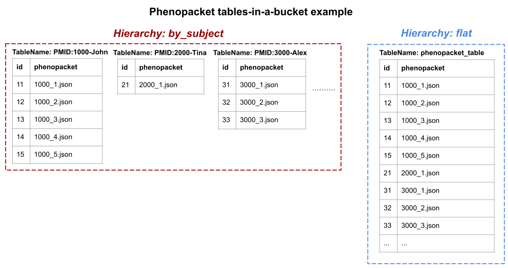

# Data Connect Specification

This document describes the overall structure of the Data Connect API and specifies how an implementation should parse, execute, and respond to a search expressed as an SQL query. Independently developed implementations that conform to this specification can be used interchangeably by a client, or networked together into a tree-structured federation of Data Connect nodes.

## Table of Contents

- [Data Connect Specification](#data-connect-specification)
  - [Overview](#overview)
  - [Conventions](#conventions)
  - [Table Discovery and Browsing](#table-discovery-and-browsing)
      - [Table Discovery and Browsing Examples](#table-discovery-and-browsing-examples)
  - [Search](#search)
    - [Search Example](#search-example)
      - [Search Request](#search-request)
        - [Positional Query Parameters](#positional-query-parameters)
        - [Correspondence Between SQL and JSON Data Types in Search Request](#correspondence-between-sql-and-json-data-types-in-search-request)
      - [Search Result](#search-result)
        - [Correspondence Between SQL and JSON Data Types in the Search Result](#correspondence-between-sql-and-json-data-types-in-the-search-result)
  - [Semantic Data Types](#semantic-data-types)
    - [Example: Semantic Data Types on a Table](#example-semantic-data-types-on-a-table)
    - [Attaching Semantic Data Types To Search Results](#attaching-semantic-data-types-to-search-results)
    - [Example: Semantic Data Types in Search Results](#example-semantic-data-types-in-search-results)
  - [SQL Functions](#sql-functions)
  - [Pagination and Long Running Queries](#pagination-and-long-running-queries)
- [Supplementary Information](#supplementary-information)
  - [Interop with other data storage and transmission standards](#interop-with-other-data-storage-and-transmission-standards)
    - [Phenopackets](#phenopackets)
      - [Concrete Example](#concrete-example)
      - [Organizing Into Tables](#organizing-into-tables)
  - [How to Secure Implementations Based on Trino Connectors or PostgreSQL Foreign Data Wrappers](#how-to-secure-implementations-based-on-trino-connectors-or-postgresql-foreign-data-wrappers)
  - [Implementing a Federation of SQL Query Nodes](#implementing-a-federation-of-sql-query-nodes)
- [Appendix A: SQL Grammar](#appendix-a-sql-grammar)

## Overview

The primary container for data in the Data Connect API is the **Table**. Tables contain rows of data, where each row is a JSON object with key/value pairs. The table describes the structure of its row objects using [JSON Schema](https://json-schema.org/). Row attributes can take on any legal JSON value, e.g. numbers, strings, booleans, nulls, arrays, and nested JSON objects.

The API supports browsing and discovery of data models and table metadata, listing table data, and optionally searching table data using arbitrarily complex expressions including joins and aggregations. The query language is SQL with domain-specific functions to facilitate informative typing of the result fields. 

All discovery, browsing and search operations are specified formally in the [OpenAPI specification](https://github.com/ga4gh-discovery/ga4gh-discovery-search/blob/develop/spec/api.yaml) document.

## Conventions

The keywords "MUST", "MUST NOT", "REQUIRED", "SHALL", "SHALL NOT", "SHOULD", "SHOULD NOT", "RECOMMENDED",  "MAY", and "OPTIONAL" in this document are to be interpreted as described in [RFC 2119](https://tools.ietf.org/html/rfc2119).

## Table Discovery and Browsing

The Table Discovery and Browsing part of the Data Connect API consists of these HTTP resources, which provide information about the tables available.  Machine actionable descriptions of their schema and semantics are provided.

| Request                    | Description                                                                 |
| -------------------------- | --------------------------------------------------------------------------- |
| `GET /tables`                | Retrieve a paginated list of tables available from this Data Connect API instance |
| `GET /table/{id}/info`     | Retrieve the data model (JSON Schema) associated with the given table |
| `GET /table/{id}/data`     | Retrieve the data rows (paginated) from the given table and the data model of the retrieved data. |

More information on the table structure is provided in [TABLE.md](TABLE.md).

### Table Discovery and Browsing Examples

```
GET /tables
```
```
{
  "tables": [
    {
      "name": "search_cloud.brca_exchange.v32",
      "data_model": {
        "$ref": "https://example.com/table/search_cloud.brca_exchange.v32/info"
      }
    },
    {
      "name": "pgpc.ontology.axiom",
      "data_model": {
        "$ref": "https://example.com/table/pgpc.ontology.axiom/info"
        }
    },
    ...
    ...
  ],
  "pagination": {
    "next_page_url": "https://example.com/tables/catalog/search_drs"
  }
}
```

```
GET `/table/pgpc.ontology.axiom/info`
```
```
{
  "name": "pgpc.ontology.axiom",
  "data_model": {
    "$id": "https://example.com/table/pgpc.ontology.axiom/info",
    "description": "Automatically generated schema",
    "$schema": "http://json-schema.org/draft-07/schema#",
    "properties": {
      "ontology": {
        "format": "varchar",
        "type": "string",
      },
      "ontology_version": {
        "format": "varchar",
        "type": "string",
      },
      "from_term": {
        "format": "varchar",
        "type": "string",
      },
      "relation": {
        "format": "varchar",
        "type": "string",
      },
      "to_term": {
        "format": "varchar",
        "type": "string",
      }
    }
  }
}
```


```
GET /table/pgpc.ontology.axiom/data
```
```
{
  "data_model": { <described in the /info example above> },
  "data": [
    {
      "ontology": "http://purl.obolibrary.org/obo/hp.owl",
      "ontology_version": "http://purl.obolibrary.org/obo/hp/releases/2019-04-15",
      "from_term": "HP_0100572",
      "relation": "SubClassOf",
      "to_term": "HP_0100571"
    },
    {
      "ontology": "http://purl.obolibrary.org/obo/hp.owl",
      "ontology_version": "http://purl.obolibrary.org/obo/hp/releases/2019-04-15",
      "from_term": "UBERON_0005047",
      "relation": "SubClassOf",
      "to_term": "UBERON_0001824"
    },
    ...
    ...
  ],
  "pagination": {
    "next_page_url": "https://example.com/search/v1/statement/executing/20200901_013328_00039_szpff/y4134d1e51a8262d0f8fed899b2eed9fd02e200e9/1"
}
```

## Search

The Search part of the Data Connect API consists of the following HTTP endpoint:

| Request                    | Description                                                                 |
| -------------------------- | --------------------------------------------------------------------------- |
| `POST /search`               | Executes the given SQL query and returns the results as a Table             |


### Search Example


#### Search Request

Here is a concrete example of a search request against a Data Connect implementation.

```
POST Request:
/search

Header:
content-type: application/json

Request body:
{ "query": "SELECT * from pgpc.ontology.axiom WHERE to_term='UBERON_0000464'"}
```

##### Positional Query Parameters

This query has the effect as the previous example, but is expressed using a positional parameter:

```
POST Request:
/search

Header:
content-type: application/json

Request body:
{
  "query": "SELECT * from pgpc.ontology.axiom WHERE to_term=?"
  "parameters": [ "UBERON_0000464" ]
}
```

A positional parameter is marked by a `?` anywhere a literal value of any type could appear in the query.

If a query has no positional parameters, the client MAY omit the `parameters` property from the request.
If the client supplies `parameters` in a query with no positional parameters, its value MUST be an empty
array.

If a query has one or more positional parameters, the request body MUST include a `parameters` property,
which is a JSON array whose element count matches the number of `?` placeholders in the query. Values
will be substituted from the array into the query on the server side in the order the `?` placeholders
appear in the text of the SQL query.

##### Correspondence Between SQL and JSON Data Types in Data Connect Request

The SQL type of `?` placeholder in the query is determined by its corresponding entry in the
`parameters` array, according to the following table.

| JSON Parameter Type                            | SQL Type  | Example Values                                |
| ---------------------------------------------- | --------- | --------------------------------------------- |
| boolean                                        | boolean   | `true`, `false`                               |
| number                                         | double    | `123`, `-7000`, `123.456`, `7.445e-17`        |
| string                                         | varchar   | `"Hello world"`, `"12345678910"`              |
| array (note all elements must have same type)  | array     | `[ 1, 3, 5 ]`, `[ "one", "three", "five" ]`   |
| object                                         | row       | `{ "colname1": "colvalue1", "colname2": 42 }` |

Queries that require parameters with SQL types not covered above should use the SQL CAST operation. For
example, `CAST(? AS DATE)`.

#### Search Result

The result is returned in the same data structure as tables are returned by the discovery and browsing part of the Data Connect API: a **TableData** object.

```

{
  "data_model": { <described in the /info example above> },
  "data": [
    {
      "ontology": "http://purl.obolibrary.org/obo/hp.owl",
      "ontology_version": "http://purl.obolibrary.org/obo/hp/releases/2019-04-15",
      "from_term": "UBERON_0009572",
      "relation": "SubClassOf",
      "to_term": "UBERON_0000464"
    },
    {
      "ontology": "http://purl.obolibrary.org/obo/hp.owl",
      "ontology_version": "http://purl.obolibrary.org/obo/hp/releases/2019-04-15",
      "from_term": "UBERON_0009670",
      "relation": "SubClassOf",
      "to_term": "UBERON_0000464"
    },
    ...
    ...
  ],
  "pagination": {
    "next_page_url": "https://example.com/search/v1/statement/executing/20200831_235126_36756_szpff/yf9a38c74873e654f04309fe956cb40c8fb2d022f/1"
  }
}

```
##### Correspondence Between SQL and JSON Data Types in the Search Result

Data is manipulated in the query using the following types. Each SQL type is expressed as a physical JSON value in the response table. Semantic types (defined by JSON Schema reference URLs) are covered in the next section.

| SQL Type                      | JSON Type                                                    | Example Values                                               |
| ----------------------------- | ------------------------------------------------------------ | ------------------------------------------------------------ |
| boolean                       | boolean                                                      | true false                                                   |
| tinyint, smallint, integer    | number                                                       | 123 -7000                                                    |
| real, double                  | number                                                       | 123.456 7.445e-17                                            |
| decimal, bigint               | string                                                       | "12345.678910"                                               |
| varchar, char                 | string                                                       | "Hello world"                                                |
| JSON                          | Same JSON type (object, array, string, number, boolean, or null) | { "k1": "v1", "k2": false }[ 1, 3, 5, "seven", [ 1 ] ] "Hello JSON" 123.456 false null |
| date                          | string in ISO 8601 format                                    | "2020-05-27"                                                 |
| time [without time zone]      | string in ISO 8601 format                                    | "12:22:27.000"                                               |
| time with time zone           | string in ISO 8601 format                                    | "12:22:27.000Z" "12:22:27.000-03:00"                         |
| timestamp [without time zone] | string in ISO 8601 format                                    | "2020-05-27T12:22:27.000"                                    |
| timestamp with time zone      | string in ISO 8601 format                                    | "2020-05-27T12:22:27.000Z" "2020-05-27T12:22:27.000-05:00"   |
| interval day to month         | String in ISO 8601 period format                             | "P3Y2M"                                                      |
| interval day to second        | String in ISO 8601 duration format                           | "P3DT4H3M2S" "PT3M2S" "PT4H3M"                               |
| array                         | array                                                        | [ 1, 3, 5, "seven", [ 1 ] ]                                  |
| map                           | object                                                       | { "key": "value" }                                           |
| row                           | object                                                       | { "colname": "colvalue" }                                    |

## Semantic Data Types

To enable discovery of tables based on the kind of information contained within them, and to enable query tools to offer to filter and join data from different sources in a sensible way, tables need to declare not only the physical type of their rows (e.g. how data is represented as JSON) but also the semantic type (what the data means).

Data Connect API describes the _meaning_ of data through JSON Schema references ($ref). Clients can discover that attributes in different tables refer to the same concept as each other by examining the target of each attribute’s JSON Schema reference. If the $ref URLs are the same, then the client knows that the attributes have the same meaning.

Clients can use the attribute meanings to:

*   Recommend joining tables that contain similar types of information
*   Display table attributes in a meaningful way
*   Construct queries across tables in an informed way which retains the underlying meaning of the data, or create new meaning

This system of identifying types through reference URLs is amenable to building up cross-references. With a rich set of cross-references, a Data Connect API client can help join up data from sources that use different nomenclatures, and link concepts to external ontologies.


### Example: Semantic Data Types on a Table 

Assume the following JSON Schema is published at https://schemablocks.org/schemas/playground/current/BloodGroup.json:

```
{
  "$schema": "http://json-schema.org/draft-07/schema#",
  "$id": "https://schemablocks.org/schemas/playground/current/BloodGroup.json",
  "allOf": [
    {
      "$ref": "https://schemablocks.org/schemas/sb-phenopackets/v1.0.0/OntologyClass.json#/properties"
    },
    {
      "properties": {
        "id": {
          "description": "Subtype of HP:0032224 (ABO Blood Group)",
          "oneOf": [
            {
              "const": "HP:0032442",
              "title": "O"
            },
            {
              "const": "HP:0032370",
              "title": "A"
            },
            {
              "const": "HP:0032440",
              "title": "B"
            },
            {
              "const": "HP:0032441",
              "title": "AB"
            }
          ]
        }
      }
    }
  ]
}
```


Then data exposed through Data Connect API could refer to the concept of “ABO Blood Group” as: 

```
"$ref": "https://schemablocks.org/schemas/playground/current/BloodGroup.json"
```

SchemaBlocks is the recommended repository for centrally defined types, but any URL that points to a valid JSON Schema definition is acceptable. In many cases, the quickest route to publishing data will be to translate existing data dictionaries into JSON Schema and publish those alongside the dataset. However, the dataset will provide greater utility to its consumers if concepts are mapped to SchemaBlocks definitions where possible.

#### Identifiers

Many columns in datasets will contain identifiers of related objects. The descriptions for such columns should provide machine actionable information about the type of identifiers used. The general purpose CURIE SchemaBlock may be used https://schemablocks.org/schemas/sb-vr-spec/current/Curie.json.  Preferably the column description should indicate the specific CURIE prefix (namespace) for the identifiers. This should cover both the use case where the values in the described table are prefixed, and the use case where they are not. In either case, the identifier name space provided in the column metadata allows simple identification of what other resources the column can be linked to.

#### DRS Identifiers

A common use case will be to provide GA4GH [Data Repository Service](https://github.com/ga4gh/data-repository-service-schemas) (DRS) identifiers which can be used to retrieve specific digital files for analysis. Where a column of a table contains DRS ids, the column description should indicate this. DRS ids maybe host based URIs, or a CURIE as above.


### Attaching Semantic Data Types To Search Results

Since search results are also Tables, there are many scenarios where users would benefit from semantic schema references being embedded in Search results as well as static views of tables.

When submitting an SQL query to the /search endpoint, the tool generating the query can wrap each selected column in the function `ga4gh_type()`, which directs the Data Connect implementation to generate a corresponding JSON Schema `$ref` for that column in the result table.

```
SELECT ga4gh_type(
  t.age, '$ref:https://schemablocks.org/schemas/sb-phenopackets/current/Age.json#properties/age') AS age
FROM mytable t
WHERE t.age > 18
```

Any selected columns that are not wrapped in the ga4gh_type() function will only have their physical characteristics described in the result table’s schema. This is perfectly acceptable for some client applications, but greatly limits the value of result tables that are archived or forwarded to another tool for further processing.


### Example: Semantic Data Types in Search Results

Assume a Data Connect implementation has the table `pgpc.public.participant` contains the following data:

| id                 | blood_type   |
| ------------------ | ------------ |
| PGPC-44            | 0            |
| PGPC-46            | AB           |

The following query to the `/search` endpoint will lift this raw, unharmonized data into a semantically typed table
with data errors corrected, and types mapped to externally defined schema concepts:

```
select
    ga4gh_type(id, '$ref:https://schemablocks.org/schemas/sb-phenopackets/current/Person.json#properties/individualId') as id,
    ga4gh_type(
        case when blood_type = '' then null
        else cast(row(
            case regexp_extract(blood_type, '(\w+)([+-])', 1)
                when '0' then 'HP:0032442' -- source data has '0' where it should have 'O'
                when 'O' then 'HP:0032442'
                when 'A' then 'HP:0032370'
                when 'B' then 'HP:0032440'
                when 'AB' then 'HP:0032441'
                else 'error'
            end,
            case regexp_extract(blood_type, '(\w+)([+-])', 1)
                when '0' then 'O'
                else regexp_extract(blood_type, '(\w+)([+-])', 1)
            end
        )
        as row(id varchar, label varchar))
    end, 
    '$ref:https://schemablocks.org/schemas/playground/current/BloodGroup.json') as blood_group
from pgpc.public.participant
```

The Data Connect service responds with the following table:

```
{
  "data_model": {
    "description": "Schema specified by query",
    "$schema": "http://json-schema.org/draft-07/schema#",
    "properties": {
      "id": {
        "$ref": "https://schemablocks.org/schemas/sb-phenopackets/current/Person.json#properties/individualId"
      },
      "blood_group": {
        "$ref": "https://schemablocks.org/schemas/playground/current/BloodGroup.json"
      }
    }
  },
  "data": [
    {
      "id": "PGPC-44",
      "blood_group": {"id": "HP:0032442", "label": "O"}
    },
    {
      "id": "PGPC-46",
      "blood_group": {"id": "HP:0032441", "label": "AB"}
    }
  ]
}
```

## SQL Functions

Data Connect specification is implementation-agnostic and does not prescribe use of a relational database or a particular database technology. However, for convenience, its SQL dialect has been selected for compatibility with current major open source database platforms including Trino, PostgreSQL, MySQL, and well as BigQuery. There are occasional name or signature differences, but a Data Connect API implementation atop any of the major database platforms should be able to pass through queries that use the functions listed below with only minor tweaks.

With Trino (formerly PrestoSQL) being a popular database choice in Data Connect implementations, we've chosen its grammar as the basis for the grammar supported by Data Connect. Functions below are a subset of those available in Trino 341, and must behave according to the Trino documentation in a conforming Data Connect implementation. To assist with implementations directly on other database platforms, the [Trino Functions Support Matrix](https://docs.google.com/document/d/1y51qNuoe2ELX9kCOyQbFB4jihiKt2N8Qcd6-zzadIvk) captures the differences between platforms in granular detail. 

*   **Logical Operators**
    *   `AND`, `OR`, `NOT`
*   **Comparison Operators**
    *   `&lt;`, `>`, `&lt;=`, `>=`, `=`, `&lt;>`, `!=`
    *   `BETWEEN, IS NULL, IS NOT NULL`
    *   `IS DISTINCT FROM`*
    *   `IS NOT DISTINCT FROM`*
    *   `GREATEST`, `LEAST`
    *   Quantified Comparison Predicates: `ALL`, `ANY` and `SOME`*
    *   Pattern Comparison: `LIKE`
*   **Conditional Expressions**
    *   `CASE`, `IF`, `COALESCE`, `NULLIF`
*   **Conversion Functions**
    *   `cast(value AS type)` → `type`
    *   `format(format, args...)` → `varchar`
*   **Mathematical Functions**
    *   Most basic functions are supported across implementations. Notably missing are hyperbolic trig functions, infinity, floating point, and statistical/CDF functions.
    *   `abs(x)` → [same as input]
    *   `ceil(x)` → [same as input]
    *   `ceiling(x)` → [same as input]
    *   `degrees(x)` → `double`*
    *   `exp(x)` → `double`
    *   `floor(x)` → [same as input]
    *   `ln(x)` → `double`
    *   `log(b, x)` → `double`
    *   `log10(x)` → `double`
    *   `mod(n, m)` → [same as input]
    *   `pi()` → `double`
    *   `pow(x, p)` → `double`*
    *   `power(x, p)` → `double`
    *   `radians(x)` → `double`*
    *   `round(x)` → [same as input]
    *   `round(x, d)` → [same as input]
    *   `sign(x)` → [same as input]
    *   `sqrt(x)` → `double`
    *   `truncate(x)` → `double`*
    *   Random Functions:
        *   `rand()` → `double`*
        *   `random()` → `double`*
        *   `random(n)` → [same as input]*
        *   `random(m, n)` → [same as input]*
    *   Trigonometric Functions:
        *   `acos(x)` → `double`
        *   `asin(x)` → `double`
        *   `atan(x)` → `double`
        *   `atan2(y, x)` → `double`
        *   `cos(x)` → `double`
        *   `sin(x)` → `double`
        *   `tan(x)` → `double`
*   **Bitwise Functions**
    *   `bitwise_and(x, y)` → `bigint`
    *   `bitwise_or(x, y)` → `bigint`
    *   `bitwise_xor(x, y)` → `bigint`
    *   `bitwise_not(x)` → `bigint`
    *   `bitwise_left_shift(value, shift)` → [same as value]
    *   `bitwise_right_shift(value, shift, digits)` → [same as value]
    *   `bit_count(x, bits)` → `bigint`*
*   **Regular Expression Functions**
    *   `regexp_extract_all(string, pattern)` -> `array(varchar)`*
    *   `regexp_extract_all(string, pattern, group)` -> `array(varchar)`*
    *   `regexp_extract(string, pattern)` → `varchar`*
    *   `regexp_extract(string, pattern, group)` → `varchar`*
    *   `regexp_like(string, pattern)` → `boolean`*
    *   `regexp_replace(string, pattern)` → `varchar`*
    *   `regexp_replace(string, pattern, replacement)` → `varchar`*
    *   `regexp_replace(string, pattern, function)` → `varchar`*
*   **UUID Functions**
    *   `uuid()*`
*   **Session Information Functions**
    *   `current_user`*
*   **String manipulation**
    *   **Operators:**
        *   `Concatenation (||)`*
        *   `LIKE`
    *   **Functions:**
        *   `chr(n)` → `varchar`*
        *   `codepoint(string)` → `integer`*
        *   `format(format, args...)` → `varchar`
        *   `length(string)` → `bigint`
        *   `lower(string)` → `varchar`
        *   `lpad(string, size, padstring)` → `varchar`
        *   `ltrim(string)` → `varchar`
        *   `position(substring IN string)` → `bigint`*
        *   `replace(string, search, replace)` → `varchar`
        *   `reverse(string)` → `varchar`
        *   `rpad(string, size, padstring)` → `varchar`
        *   `rtrim(string)` → `varchar`
        *   `split(string, delimiter, limit)` -> `array(varchar)`*
        *   `starts_with(string, substring)` → `boolean`*
        *   `strpos(string, substring)` → `bigint`*
        *   `substr(string, start)` → `varchar`*
        *   `substring(string, start)` → `varchar`
        *   `substr(string, start, length)` → `varchar`*
        *   `substring(string, start, length)` → `varchar`
        *   `trim(string)` → `varchar`
        *   `upper(string)` → `varchar`
*   **Date manipulation** 
**Be aware of different quotation (‘) syntax requirements between MySQL and PostgreSQL. BigQuery does not support the +/- operators for dates. Convenience methods could be replaced with EXTRACT().**
    *   **Operators:**
        *   `+`, `- *`
        *   `AT TIME ZONE`*
    *   **Functions:**
        *   `current_date`
        *   `current_time`
        *   `current_timestamp`
        *   `current_timestamp(p)`*
        *   `date(x)` → `date`*
        *   `date_trunc(unit, x)` → [same as input]*
        *   `date_add(unit, value, timestamp)` → [same as input]*
        *   `date_diff(unit, timestamp1, timestamp2)` → `bigint`*
        *   `extract(field FROM x)` → `bigint`*
        *   `from_unixtime(unixtime)` -> `timestamp(3)`*
        *   `from_unixtime(unixtime, zone)` → `timestamp(3) with time zone`*
        *   `from_unixtime(unixtime, hours, minutes)` → `timestamp(3) with time zone`*
        *   `Localtime`*
        *   `localtimestamp`*
        *   `localtimestamp(p)`*
        *   `now()` → `timestamp(3)` with time zone*
        *   `to_unixtime(timestamp)` → `double`*
    *   **MySQL-like date functions:**
        *   `date_format(timestamp, format)` → `varchar`*
        *   `date_parse(string, format)` → `timestamp(3)`*
*   **Aggregate functions** 
**Note that Trino provides a much larger superset of functions. Bitwise, map, and approximate aggregations are mostly absent. Only BigQuery has a few native approximate aggregation functions.
    *   `array_agg(x)` → `array&lt;`[same as input]>*
    *   `avg(x)` → `double`
    *   `bool_and(boolean)` → `boolean`*
    *   `bool_or(boolean)` → `boolean`*
    *   `count(*)` → `bigint`*
    *   `count(x)` → `bigint`
    *   `count_if(x)` → `bigint`*
    *   `every(boolean)` → `boolean`*
    *   `max(x)` → [same as input]
    *   `max(x, n)` → `array&lt;`[same as x]>*
    *   `min(x)` → [same as input]
    *   `min(x, n)` → `array&lt;`[same as x]>*
    *   `sum(x)` → [same as input]
    *   **Statistical Aggregate Functions:**
        *   `corr(y, x)` → `double`*
        *   `covar_pop(y, x)`→ `double`*
        *   `covar_samp(y, x)` → `double`*
        *   `stddev(x)` → `double`
        *   `stddev_pop(x)` → `double`
        *   `stddev_samp(x)` → `double`
        *   `variance(x)` → `double`
        *   `var_pop(x)` → `double`
        *   `var_samp(x)` → `double`
*   **Window functions**
    *   **Ranking Functions:**
        *   `cume_dist()` → `bigint`
        *   `dense_rank()` → `bigint`
        *   `ntile(n)` → `bigint`
        *   `percent_rank()` → `double`
        *   `rank()` → `bigint`
        *   `row_number()` → `bigint`
    *   **Value Functions:**
        *   `first_value(x)` → [same as input]
        *   `last_value(x)` → [same as input]
        *   `nth_value(x, offset)` → [same as input]
        *   `lead(x[, offset[, default_value]])` → [same as input]
        *   `lag(x[, offset[, default_value]])` → [same as input]
*   **JSON functions 
**In general, function signatures and behaviour differs across implementations for many JSON related functions.
    *   `json_array_length(json)` → bigint*
    *   `json_extract(json, json_path)` → json*
    *   `json_extract_scalar(json, json_path)` → varchar*
    *   `json_format(json)` → `varchar`*
    *   `json_size(json, json_path)` → `bigint`*
*   Functions for working with nested and repeated data (ROW and ARRAY) 
See also UNNEST, which is part of the SQL grammar and allows working with nested arrays as if they were rows in a joined table.

Note: Arrays are mostly absent in MySQL
    *   Array Subscript Operator: []
    *   Array Concatenation Operator: ||
    *   `concat(array1, array2, ..., arrayN)` → `array`
    *   `cardinality(x)` → `bigint`*
*   ga4gh_type (described above)

## Pagination and Long Running Queries

**Pagination sequence**

A pagination sequence is the singly-linked list of URLs formed by following the next_page_url property of the pagination section of an initial TableData or ListTablesResponse. A pagination sequence begins at the first response returned from any request that yields a TableData or ListTablesResponse, and ends at the page in the sequence whose pagination property is omitted, whose pagination.next_page_url is omitted, or whose pagination.next_page_url is null.

Servers MAY return a unique pagination sequence in response to successive requests for the same query, table data listing, or table listing.

Except for the last page, pagination.next_page_url property MUST be either an absolute URL or a relative reference as defined by [RFC 3986 section 4.2](https://tools.ietf.org/html/rfc3986#section-4.2) whose base URL is the URL that the page containing the reference was fetched from.

Every non-empty TableData page in a pagination sequence MUST include a data_model property. If present, the data_model property MUST be a valid JSON Schema.

Across all TableData pages in the pagination sequence that have a data_model value, the data_models MUST be identical. Some TableData pages may lack a data_model. See the empty page rules below.

Servers MAY respond with an HTTP 4xx error code if the same page is requested more than once.

Due to both rules above, clients MUST NOT rely on the ability to re-fetch previously encountered pages.

Servers MAY include a Retry-After HTTP header in each response that is part of a pagination sequence, and clients MUST respect the delay specified by such header before attempting to fetch the next page.

**Empty TableData pages**

While many types of queries will be completed quickly, others will take minutes or even hours to yield a result. The simplest solution would be a synchronous design: query requests block until data is ready, then return a TableData response with the initial rows of the result set. However, asking clients to block for hours on a single HTTP response is fraught with difficulty: open connections are costly and fragile. If an intermediary times out the request, the results will be lost and the client must start over.

To allow servers to direct clients to poll for results rather than hold open HTTP connections for long-running queries, the following special pagination rules apply to empty pages.

An empty page is defined as a TableData object whose data property is a zero element array.

A pagination sequence MAY include any number of empty pages anywhere in the sequence.

An empty TableData page MAY omit its data_model property entirely. This allows servers to direct clients to poll for results before the result schema has been determined.

A server that returns an empty page SHOULD include a Retry-after header in the HTTP response. If a client encounters an empty page with no Retry-after header, the client SHOULD delay at least 1 second before requesting the next page.

**Example: Server returning empty pages to make client poll**

This example illustrates a server returning a series of empty pages to a client while it is preparing the result set. The client polls for results by following next_page_url at the rate specified by the server. The form of the pagination URLs are only an example of one possible scheme. Servers are free to employ any pagination URL scheme.

**Initial Request**


```
POST /search
content-type: application/json

{"query":"select distinct gene_symbol from search_cloud.brca_exchange.v32"}

HTTP/1.1 200 OK
content-type: application/json
retry-after: 1000

{"data":[],"pagination":{"next_page_url":"/search/v1/statement/abc123/queued/1"}}
```


**2nd request (Polling after sleeping for 1000ms)**


```
GET /search/v1/statement/abc123/queued/1

HTTP/1.1 200 OK
content-type: application/json
retry-after: 1000

{"data":[],"pagination":{"next_page_url":"/search/v1/statement/abc123/queued/2"}}
```


**3rd request (Polling again after sleeping for 1000ms)**


```
GET /search/v1/statement/abc123/queued/2

HTTP/1.1 200 OK
content-type: application/json
retry-after: 1000

{"data":[],"pagination":{"next_page_url":"/search/v1/statement/abc123/executing/1"}}
```


**4th request (Polling again after sleeping for 1000ms)**


```
GET /search/v1/statement/abc123/executing/1

HTTP/1.1 200 OK
content-type: application/json

{"data_model":{"description":"Automatically generated schema","$schema":"http://json-schema.org/draft-07/schema#","properties":{"gene_symbol":{"format":"varchar","type":"string"}}},"data":[{"gene_symbol":"BRCA2"},{"gene_symbol":"BRCA1"}],"pagination":{"next_page_url":"/search/v1/statement/abc123/executing/2"}}
```


**Final request (no delay because page was nonempty and no retry-after header was present on the response)**


```
GET /search/v1/statement/abc123/executing/2

HTTP/1.1 200 OK
content-type: application/json

{"data_model":{"description":"Automatically generated schema","$schema":"http://json-schema.org/draft-07/schema#","properties":{"gene_symbol":{"format":"varchar","type":"string"}}},"data":[],"pagination":{}}
```


**Example: Client algorithm for consuming TableData pages**

The algorithm provided here simply illustrates one way to comply with the rules above. Any algorithm that satisfies all rules acceptable.


1. Start with an empty data buffer and undefined data model.
2. Loop:
    1. If the response is an error, report the error and abort
    2. If no data_model has been seen so far, check if this page contains a data_model. If so, define the data model for the whole pagination sequence as this page’s data_model.
    3. Append the row data from the current page to the data buffer (there may be 0 rows on any given page)
    4. Delay for the time specified in the “Retry-After” HTTP response header for the current page (default is no delay)
    5. If there is a pagination object and it has a non-null next_page_url, fetch that URL, make that response the current page, and start back at step 2a; otherwise end.


# Supplementary Information 

This section provides advice to implementers. Nothing in this section is required of a conforming implementation.


## Interop with other data storage and transmission standards 

This section demonstrates how to expose data stored in commonly used formats using Data Connect Table structures and their embedded JSON schema specifications.


### Phenopackets 

Phenopacket is a GA4GH approved standard file format for sharing phenotypic information. A Phenopacket file contains a set of mandatory and optional fields to share information about a patient or participant’s phenotype, such as clinical diagnosis, age of onset, results from lab tests, and disease severity.


#### Concrete Example 

Here is a detailed example of a directory full of Phenopacket files exposed as a single table via the Data Connect API. Each row corresponds to one Phenopacket. The table has two columns: 

*   **id**, the ID of that row’s Phenopacket
*   **phenopacket**, the entire contents of the Phenopacket as a JSON object

```
/tables
```


```
{
  "tables": [
  {
    "name": "gecco_phenopackets",
    "description": "Table / directory containing Phenopacket JSON files",
    "data_model": {
      "$ref": "table/gecco_phenopackets/info"
    }
  },
  {
    "name": "hpo_phenopackets",
    "description": "Table / directory containing Phenopacket JSON files",
    "data_model": {
      "$ref": "table/hpo_phenopackets/info"
    }
  }
 ]
}
```


```
/table/hpo_phenopackets/info
```
```
{
  "name": "hpo_phenopackets",
  "description": "Table / directory containing Phenopacket JSON files",
  "data_model": {
    "$id": "https://storage.googleapis.com/ga4gh-phenopackets-example/phenopacket-with-id",
    "$schema": "http://json-schema.org/draft-07/schema#",
    "description": "Phenopacket JSON data model",
    "properties": {
      "id": {
        "type": "string",
        "description": "An identifier specific for this phenopacket"
    },
      "phenopacket": {
        "$ref": "https://schemablocks.org/schemas/sb-phenopackets/current/Phenopacket.json"
      }
    }
  }
}
```
```
/table/hpo_phenopackets/data
```


```
{
  "data_model": {
    "$id": "https://storage.googleapis.com/ga4gh-phenopackets-example/phenopacket-with-id",
    "$schema": "http://json-schema.org/draft-07/schema#",
    "description": "Phenopacket JSON data model",
    "properties": {
      "id": {
        "type": "string",
        "description": "An identifier specific for this phenopacket"
      },
      "phenopacket": {
        "$ref": "https://schemablocks.org/schemas/sb-phenopackets/current/Phenopacket.json"
      }
    }
  },
  "data": [
    {
      "id": "PMID:27435956-Naz_Villalba-2016-NLRP3-proband",
      "phenopacket": {actual phenopacket json}
    },
    {
      "id": "PMID:27672653-Abdul_Wahab-2016-GCDH-Patient_5",
      "phenopacket": {actual phenopacket json}
    },
    {
      "id": "PMID:20149460-Papanastasiou-2010-STAT3-12_year_old_girl",
      "phenopacket": {actual phenopacket json}
    },
    ...
    ...
    ...
  ]
}
```

```
/table/hpo_phenopackets/search
```

```

REQUEST:
---------------------------------------------------------------------------------------
WITH pp_genes AS (
  SELECT
    pp.id AS packet_id, 
    json_extract_scalar(g.gene, '$.id') AS gene_id,
    json_extract_scalar(g.gene, '$.symbol') AS gene_symbol
  FROM
    sample_phenopackets.ga4gh_tables.hpo_phenopackets pp,
    UNNEST(CAST(json_extract(pp.phenopacket, '$.genes') as ARRAY(json))) 
      as g (gene)
)
SELECT pp_genes.*
FROM pp_genes 
WHERE gene_symbol LIKE 'ANTXR%'
LIMIT 100;
RESPONSE:
------------------------------------------------------------+-----------------+--------
 PMID:30050362-Schussler-2018-ANTXR2-II-3_                  | NCBIGene:118429 | ANTXR2      
 PMID:27587992-Salas-Alanís-2016-ANTXR1-14_year_old_brother | NCBIGene:84168  | ANTXR1

```

#### Organizing Into Tables 

Here we demonstrate two possibilities for organizing a collection of Phenopacket JSON files into tables. Other layouts are also possible.

FLAT hierarchy - all files in a single table

*   [https://storage.googleapis.com/ga4gh-phenopackets-example/flat/tables](https://storage.googleapis.com/ga4gh-phenopackets-example/flat/tables)
*   [https://storage.googleapis.com/ga4gh-phenopackets-example/flat/table/phenopacket_table/info](https://storage.googleapis.com/ga4gh-phenopackets-example/flat/table/phenopacket_table/info)
*   [https://storage.googleapis.com/ga4gh-phenopackets-example/flat/table/phenopacket_table/data](https://storage.googleapis.com/ga4gh-phenopackets-example/flat/table/phenopacket_table/data)

BY_SUBJECT hierarchy - one table per subject ID

*   [https://storage.googleapis.com/ga4gh-phenopackets-example/by_subject/tables](https://storage.googleapis.com/ga4gh-phenopackets-example/by_subject/tables)
*   [https://storage.googleapis.com/ga4gh-phenopackets-example/by_subject/table/PMID:27435956_longitudinal/info](https://storage.googleapis.com/ga4gh-phenopackets-example/by_subject/table/PMID:27435956_longitudinal/info)
*   [https://storage.googleapis.com/ga4gh-phenopackets-example/by_subject/table/PMID:27435956_longitudinal/data](https://storage.googleapis.com/ga4gh-phenopackets-example/by_subject/table/PMID:27435956_longitudinal/data) (has 1 Phenopacket)
*   [https://storage.googleapis.com/ga4gh-phenopackets-example/by_subject/table/PMID:27040691_longitudinal/data](https://storage.googleapis.com/ga4gh-phenopackets-example/by_subject/table/PMID:27040691_longitudinal/data) (has multiple Phenopackets)

The difference between the two formats is the way in which the Phenopacket JSON data is structured in one table (flat) or multiple tables (by_subject) as shown in the following diagram.




## How to Secure Implementations Based on Trino Connectors or PostgreSQL Foreign Data Wrappers

*   Filter data at the connector level
*   Use simple OAuth scopes to decide what data can be returned
*   If certain scopes should only see aggregated data (for privacy reasons), use separate aggregated tables (or views). The connector should only pull data from these pre-summarized views.


## Implementing a Federation of SQL Query Nodes 

*   Two approaches: “foreign data wrappers” and “fan-out/hub-and-spoke”
*   Foreign data wrappers:
    *   Many SQL engines support user-provided connectors to external data:
        *   PostgreSQL: foreign data wrappers
        *   Presto DB: Connectors
        *   Apache Hive: Deserializers (SerDe without a serialization support)


# Appendix A: SQL Grammar

ANTLR grammar for Data Connect (based on Trino (formerly Trino v. 323, ASL 2.0 license), with the DML and DDL parts removed:


```
grammar DataConnect;

tokens {
    DELIMITER
}

singleStatement
    : statement EOF
    ;

standaloneExpression
    : expression EOF
    ;

standaloneType
    : type EOF
    ;

statement
    : query                                                            #statementDefault
    | USE schema=identifier                                            #use
    | USE catalog=identifier '.' schema=identifier                     #use
    | EXPLAIN ANALYZE? VERBOSE?
        ('(' explainOption (',' explainOption)* ')')? statement        #explain
    | SHOW TABLES ((FROM | IN) qualifiedName)?
        (LIKE pattern=string (ESCAPE escape=string)?)?                 #showTables
    | SHOW SCHEMAS ((FROM | IN) identifier)?
        (LIKE pattern=string (ESCAPE escape=string)?)?                 #showSchemas
    | SHOW CATALOGS (LIKE pattern=string)?                             #showCatalogs
    | SHOW COLUMNS (FROM | IN) qualifiedName                           #showColumns
    | DESCRIBE qualifiedName                                           #showColumns
    | DESC qualifiedName                                               #showColumns
    | SHOW FUNCTIONS                                                   #showFunctions
    ;

query
    :  with? queryNoWith
    ;

with
    : WITH RECURSIVE? namedQuery (',' namedQuery)*
    ;

queryNoWith:
      queryTerm
      (ORDER BY sortItem (',' sortItem)*)?
      (OFFSET offset=INTEGER_VALUE (ROW | ROWS)?)?
      ((LIMIT limit=(INTEGER_VALUE | ALL)) | (FETCH (FIRST | NEXT) (fetchFirst=INTEGER_VALUE)? (ROW | ROWS) (ONLY | WITH TIES)))?
    ;

queryTerm
    : queryPrimary                                                             #queryTermDefault
    | left=queryTerm operator=INTERSECT setQuantifier? right=queryTerm         #setOperation
    | left=queryTerm operator=(UNION | EXCEPT) setQuantifier? right=queryTerm  #setOperation
    ;

queryPrimary
    : querySpecification                   #queryPrimaryDefault
    | TABLE qualifiedName                  #table
    | VALUES expression (',' expression)*  #inlineTable
    | '(' queryNoWith  ')'                 #subquery
    ;

sortItem
    : expression ordering=(ASC | DESC)? (NULLS nullOrdering=(FIRST | LAST))?
    ;

querySpecification
    : SELECT setQuantifier? selectItem (',' selectItem)*
      (FROM relation (',' relation)*)?
      (WHERE where=booleanExpression)?
      (GROUP BY groupBy)?
      (HAVING having=booleanExpression)?
    ;

groupBy
    : setQuantifier? groupingElement (',' groupingElement)*
    ;

groupingElement
    : groupingSet                                            #singleGroupingSet
    | ROLLUP '(' (expression (',' expression)*)? ')'         #rollup
    | CUBE '(' (expression (',' expression)*)? ')'           #cube
    | GROUPING SETS '(' groupingSet (',' groupingSet)* ')'   #multipleGroupingSets
    ;

groupingSet
    : '(' (expression (',' expression)*)? ')'
    | expression
    ;

namedQuery
    : name=identifier (columnAliases)? AS '(' query ')'
    ;

setQuantifier
    : DISTINCT
    | ALL
    ;

selectItem
    : expression (AS? identifier)?                          #selectSingle
    | primaryExpression '.' ASTERISK (AS columnAliases)?    #selectAll
    | ASTERISK                                              #selectAll
    ;

relation
    : left=relation
      ( CROSS JOIN right=sampledRelation
      | joinType JOIN rightRelation=relation joinCriteria
      | NATURAL joinType JOIN right=sampledRelation
      )                                           #joinRelation
    | sampledRelation                             #relationDefault
    ;

joinType
    : INNER?
    | LEFT OUTER?
    | RIGHT OUTER?
    | FULL OUTER?
    ;

joinCriteria
    : ON booleanExpression
    | USING '(' identifier (',' identifier)* ')'
    ;

sampledRelation
    : aliasedRelation (
        TABLESAMPLE sampleType '(' percentage=expression ')'
      )?
    ;

sampleType
    : BERNOULLI
    | SYSTEM
    ;

aliasedRelation
    : relationPrimary (AS? identifier columnAliases?)?
    ;

columnAliases
    : '(' identifier (',' identifier)* ')'
    ;

relationPrimary
    : qualifiedName                                                   #tableName
    | '(' query ')'                                                   #subqueryRelation
    | UNNEST '(' expression (',' expression)* ')' (WITH ORDINALITY)?  #unnest
    | LATERAL '(' query ')'                                           #lateral
    | '(' relation ')'                                                #parenthesizedRelation
    ;

expression
    : booleanExpression
    ;

booleanExpression
    : valueExpression predicate[$valueExpression.ctx]?             #predicated
    | NOT booleanExpression                                        #logicalNot
    | left=booleanExpression operator=AND right=booleanExpression  #logicalBinary
    | left=booleanExpression operator=OR right=booleanExpression   #logicalBinary
    ;

// workaround for https://github.com/antlr/antlr4/issues/780
predicate[ParserRuleContext value]
    : comparisonOperator right=valueExpression                            #comparison
    | comparisonOperator comparisonQuantifier '(' query ')'               #quantifiedComparison
    | NOT? BETWEEN lower=valueExpression AND upper=valueExpression        #between
    | NOT? IN '(' expression (',' expression)* ')'                        #inList
    | NOT? IN '(' query ')'                                               #inSubquery
    | NOT? LIKE pattern=valueExpression (ESCAPE escape=valueExpression)?  #like
    | IS NOT? NULL                                                        #nullPredicate
    | IS NOT? DISTINCT FROM right=valueExpression                         #distinctFrom
    ;

valueExpression
    : primaryExpression                                                                 #valueExpressionDefault
    | valueExpression AT timeZoneSpecifier                                              #atTimeZone
    | operator=(MINUS | PLUS) valueExpression                                           #arithmeticUnary
    | left=valueExpression operator=(ASTERISK | SLASH | PERCENT) right=valueExpression  #arithmeticBinary
    | left=valueExpression operator=(PLUS | MINUS) right=valueExpression                #arithmeticBinary
    | left=valueExpression CONCAT right=valueExpression                                 #concatenation
    ;

primaryExpression
    : NULL                                                                                #nullLiteral
    | interval                                                                            #intervalLiteral
    | identifier string                                                                   #typeConstructor
    | DOUBLE PRECISION string                                                             #typeConstructor
    | number                                                                              #numericLiteral
    | booleanValue                                                                        #booleanLiteral
    | string                                                                              #stringLiteral
    | BINARY_LITERAL                                                                      #binaryLiteral
    | '?'                                                                                 #parameter
    | POSITION '(' valueExpression IN valueExpression ')'                                 #position
    | '(' expression (',' expression)+ ')'                                                #rowConstructor
    | ROW '(' expression (',' expression)* ')'                                            #rowConstructor
    | qualifiedName '(' ASTERISK ')' filter? over?                                        #functionCall
    | qualifiedName '(' (setQuantifier? expression (',' expression)*)?
        (ORDER BY sortItem (',' sortItem)*)? ')' filter? (nullTreatment? over)?           #functionCall
    | identifier '->' expression                                                          #lambda
    | '(' (identifier (',' identifier)*)? ')' '->' expression                             #lambda
    | '(' query ')'                                                                       #subqueryExpression
    // This is an extension to ANSI SQL, which considers EXISTS to be a <boolean expression>
    | EXISTS '(' query ')'                                                                #exists
    | CASE operand=expression whenClause+ (ELSE elseExpression=expression)? END           #simpleCase
    | CASE whenClause+ (ELSE elseExpression=expression)? END                              #searchedCase
    | CAST '(' expression AS type ')'                                                     #cast
    | TRY_CAST '(' expression AS type ')'                                                 #cast
    | ARRAY '[' (expression (',' expression)*)? ']'                                       #arrayConstructor
    | value=primaryExpression '[' index=valueExpression ']'                               #subscript
    | identifier                                                                          #columnReference
    | base=primaryExpression '.' fieldName=identifier                                     #dereference
    | name=CURRENT_DATE                                                                   #specialDateTimeFunction
    | name=CURRENT_TIME ('(' precision=INTEGER_VALUE ')')?                                #specialDateTimeFunction
    | name=CURRENT_TIMESTAMP ('(' precision=INTEGER_VALUE ')')?                           #specialDateTimeFunction
    | name=LOCALTIME ('(' precision=INTEGER_VALUE ')')?                                   #specialDateTimeFunction
    | name=LOCALTIMESTAMP ('(' precision=INTEGER_VALUE ')')?                              #specialDateTimeFunction
    | name=CURRENT_USER                                                                   #currentUser
    | name=CURRENT_PATH                                                                   #currentPath
    | SUBSTRING '(' valueExpression FROM valueExpression (FOR valueExpression)? ')'       #substring
    | NORMALIZE '(' valueExpression (',' normalForm)? ')'                                 #normalize
    | EXTRACT '(' identifier FROM valueExpression ')'                                     #extract
    | '(' expression ')'                                                                  #parenthesizedExpression
    | GROUPING '(' (qualifiedName (',' qualifiedName)*)? ')'                              #groupingOperation
    ;

nullTreatment
    : IGNORE NULLS
    | RESPECT NULLS
    ;

string
    : STRING                                #basicStringLiteral
    | UNICODE_STRING (UESCAPE STRING)?      #unicodeStringLiteral
    ;

timeZoneSpecifier
    : TIME ZONE interval  #timeZoneInterval
    | TIME ZONE string    #timeZoneString
    ;

comparisonOperator
    : EQ | NEQ | LT | LTE | GT | GTE
    ;

comparisonQuantifier
    : ALL | SOME | ANY
    ;

booleanValue
    : TRUE | FALSE
    ;

interval
    : INTERVAL sign=(PLUS | MINUS)? string from=intervalField (TO to=intervalField)?
    ;

intervalField
    : YEAR | MONTH | DAY | HOUR | MINUTE | SECOND
    ;

normalForm
    : NFD | NFC | NFKD | NFKC
    ;

type
    : ROW '(' rowField (',' rowField)* ')'                                         #rowType
    | INTERVAL from=intervalField (TO to=intervalField)?                           #intervalType
    | base=TIMESTAMP ('(' precision = INTEGER_VALUE ')')? (WITHOUT TIME ZONE)?     #dateTimeType
    | base=TIMESTAMP ('(' precision = INTEGER_VALUE ')')? WITH TIME ZONE           #dateTimeType
    | base=TIME ('(' precision = INTEGER_VALUE ')')? (WITHOUT TIME ZONE)?          #dateTimeType
    | base=TIME ('(' precision = INTEGER_VALUE ')')? WITH TIME ZONE                #dateTimeType
    | DOUBLE PRECISION                                                             #doublePrecisionType
    | ARRAY '<' type '>'                                                           #legacyArrayType
    | MAP '<' keyType=type ',' valueType=type '>'                                  #legacyMapType
    | type ARRAY ('[' INTEGER_VALUE ']')?                                          #arrayType
    | identifier ('(' typeParameter (',' typeParameter)* ')')?                     #genericType
    ;

rowField
    : identifier? type;

typeParameter
    : INTEGER_VALUE | type
    ;

whenClause
    : WHEN condition=expression THEN result=expression
    ;

filter
    : FILTER '(' WHERE booleanExpression ')'
    ;

over
    : OVER '('
        (PARTITION BY partition+=expression (',' partition+=expression)*)?
        (ORDER BY sortItem (',' sortItem)*)?
        windowFrame?
      ')'
    ;

windowFrame
    : frameType=RANGE start=frameBound
    | frameType=ROWS start=frameBound
    | frameType=RANGE BETWEEN start=frameBound AND end=frameBound
    | frameType=ROWS BETWEEN start=frameBound AND end=frameBound
    ;

frameBound
    : UNBOUNDED boundType=PRECEDING                 #unboundedFrame
    | UNBOUNDED boundType=FOLLOWING                 #unboundedFrame
    | CURRENT ROW                                   #currentRowBound
    | expression boundType=(PRECEDING | FOLLOWING)  #boundedFrame
    ;

explainOption
    : FORMAT value=(TEXT | GRAPHVIZ | JSON)                 #explainFormat
    | TYPE value=(LOGICAL | DISTRIBUTED | VALIDATE | IO)    #explainType
    ;

qualifiedName
    : identifier ('.' identifier)*
    ;

identifier
    : IDENTIFIER             #unquotedIdentifier
    | QUOTED_IDENTIFIER      #quotedIdentifier
    | nonReserved            #unquotedIdentifier
    | BACKQUOTED_IDENTIFIER  #backQuotedIdentifier
    | DIGIT_IDENTIFIER       #digitIdentifier
    ;

number
    : MINUS? DECIMAL_VALUE  #decimalLiteral
    | MINUS? DOUBLE_VALUE   #doubleLiteral
    | MINUS? INTEGER_VALUE  #integerLiteral
    ;

nonReserved
    // IMPORTANT: this rule must only contain tokens. Nested rules are not supported. See SqlParser.exitNonReserved
    : ADD | ADMIN | ALL | ANALYZE | ANY | ARRAY | ASC | AT
    | BERNOULLI
    | CALL | CASCADE | CATALOGS | COLUMN | COLUMNS | COMMENT | COMMIT | COMMITTED | CURRENT
    | DATA | DATE | DAY | DEFINER | DESC | DISTRIBUTED | DOUBLE
    | EXCLUDING | EXPLAIN
    | FETCH | FILTER | FIRST | FOLLOWING | FORMAT | FUNCTIONS
    | GRANT | GRANTED | GRANTS | GRAPHVIZ
    | HOUR
    | IF | IGNORE | INCLUDING | INPUT | INTERVAL | INVOKER | IO | ISOLATION
    | JSON
    | LAST | LATERAL | LEVEL | LIMIT | LOGICAL
    | MAP | MINUTE | MONTH
    | NEXT | NFC | NFD | NFKC | NFKD | NO | NONE | NULLIF | NULLS
    | OFFSET | ONLY | OPTION | ORDINALITY | OUTPUT | OVER
    | PARTITION | PARTITIONS | PATH | POSITION | PRECEDING | PRECISION | PRIVILEGES | PROPERTIES
    | RANGE | READ | RENAME | REPEATABLE | REPLACE | RESET | RESPECT | RESTRICT | REVOKE | ROLE | ROLES | ROLLBACK | ROW | ROWS
    | SCHEMA | SCHEMAS | SECOND | SECURITY | SERIALIZABLE | SESSION | SET | SETS
    | SHOW | SOME | START | STATS | SUBSTRING | SYSTEM
    | TABLES | TABLESAMPLE | TEXT | TIES | TIME | TIMESTAMP | TO | TRANSACTION | TRY_CAST | TYPE
    | UNBOUNDED | UNCOMMITTED | USE | USER
    | VALIDATE | VERBOSE | VIEW
    | WITHOUT | WORK | WRITE
    | YEAR
    | ZONE
    ;

ADD: 'ADD';
ADMIN: 'ADMIN';
ALL: 'ALL';
ALTER: 'ALTER';
ANALYZE: 'ANALYZE';
AND: 'AND';
ANY: 'ANY';
ARRAY: 'ARRAY';
AS: 'AS';
ASC: 'ASC';
AT: 'AT';
BERNOULLI: 'BERNOULLI';
BETWEEN: 'BETWEEN';
BY: 'BY';
CALL: 'CALL';
CASCADE: 'CASCADE';
CASE: 'CASE';
CAST: 'CAST';
CATALOGS: 'CATALOGS';
COLUMN: 'COLUMN';
COLUMNS: 'COLUMNS';
COMMENT: 'COMMENT';
COMMIT: 'COMMIT';
COMMITTED: 'COMMITTED';
CONSTRAINT: 'CONSTRAINT';
CREATE: 'CREATE';
CROSS: 'CROSS';
CUBE: 'CUBE';
CURRENT: 'CURRENT';
CURRENT_DATE: 'CURRENT_DATE';
CURRENT_PATH: 'CURRENT_PATH';
CURRENT_ROLE: 'CURRENT_ROLE';
CURRENT_TIME: 'CURRENT_TIME';
CURRENT_TIMESTAMP: 'CURRENT_TIMESTAMP';
CURRENT_USER: 'CURRENT_USER';
DATA: 'DATA';
DATE: 'DATE';
DAY: 'DAY';
DEALLOCATE: 'DEALLOCATE';
DEFINER: 'DEFINER';
DELETE: 'DELETE';
DESC: 'DESC';
DESCRIBE: 'DESCRIBE';
DISTINCT: 'DISTINCT';
DISTRIBUTED: 'DISTRIBUTED';
DOUBLE: 'DOUBLE';
DROP: 'DROP';
ELSE: 'ELSE';
END: 'END';
ESCAPE: 'ESCAPE';
EXCEPT: 'EXCEPT';
EXCLUDING: 'EXCLUDING';
EXECUTE: 'EXECUTE';
EXISTS: 'EXISTS';
EXPLAIN: 'EXPLAIN';
EXTRACT: 'EXTRACT';
FALSE: 'FALSE';
FETCH: 'FETCH';
FILTER: 'FILTER';
FIRST: 'FIRST';
FOLLOWING: 'FOLLOWING';
FOR: 'FOR';
FORMAT: 'FORMAT';
FROM: 'FROM';
FULL: 'FULL';
FUNCTIONS: 'FUNCTIONS';
GRANT: 'GRANT';
GRANTED: 'GRANTED';
GRANTS: 'GRANTS';
GRAPHVIZ: 'GRAPHVIZ';
GROUP: 'GROUP';
GROUPING: 'GROUPING';
HAVING: 'HAVING';
HOUR: 'HOUR';
IF: 'IF';
IGNORE: 'IGNORE';
IN: 'IN';
INCLUDING: 'INCLUDING';
INNER: 'INNER';
INPUT: 'INPUT';
INSERT: 'INSERT';
INTERSECT: 'INTERSECT';
INTERVAL: 'INTERVAL';
INTO: 'INTO';
INVOKER: 'INVOKER';
IO: 'IO';
IS: 'IS';
ISOLATION: 'ISOLATION';
JSON: 'JSON';
JOIN: 'JOIN';
LAST: 'LAST';
LATERAL: 'LATERAL';
LEFT: 'LEFT';
LEVEL: 'LEVEL';
LIKE: 'LIKE';
LIMIT: 'LIMIT';
LOCALTIME: 'LOCALTIME';
LOCALTIMESTAMP: 'LOCALTIMESTAMP';
LOGICAL: 'LOGICAL';
MAP: 'MAP';
MINUTE: 'MINUTE';
MONTH: 'MONTH';
NATURAL: 'NATURAL';
NEXT: 'NEXT';
NFC : 'NFC';
NFD : 'NFD';
NFKC : 'NFKC';
NFKD : 'NFKD';
NO: 'NO';
NONE: 'NONE';
NORMALIZE: 'NORMALIZE';
NOT: 'NOT';
NULL: 'NULL';
NULLIF: 'NULLIF';
NULLS: 'NULLS';
OFFSET: 'OFFSET';
ON: 'ON';
ONLY: 'ONLY';
OPTION: 'OPTION';
OR: 'OR';
ORDER: 'ORDER';
ORDINALITY: 'ORDINALITY';
OUTER: 'OUTER';
OUTPUT: 'OUTPUT';
OVER: 'OVER';
PARTITION: 'PARTITION';
PARTITIONS: 'PARTITIONS';
PATH: 'PATH';
POSITION: 'POSITION';
PRECEDING: 'PRECEDING';
PREPARE: 'PREPARE';
PRIVILEGES: 'PRIVILEGES';
PRECISION: 'PRECISION';
PROPERTIES: 'PROPERTIES';
RANGE: 'RANGE';
READ: 'READ';
RECURSIVE: 'RECURSIVE';
RENAME: 'RENAME';
REPEATABLE: 'REPEATABLE';
REPLACE: 'REPLACE';
RESET: 'RESET';
RESPECT: 'RESPECT';
RESTRICT: 'RESTRICT';
REVOKE: 'REVOKE';
RIGHT: 'RIGHT';
ROLE: 'ROLE';
ROLES: 'ROLES';
ROLLBACK: 'ROLLBACK';
ROLLUP: 'ROLLUP';
ROW: 'ROW';
ROWS: 'ROWS';
SCHEMA: 'SCHEMA';
SCHEMAS: 'SCHEMAS';
SECOND: 'SECOND';
SECURITY: 'SECURITY';
SELECT: 'SELECT';
SERIALIZABLE: 'SERIALIZABLE';
SESSION: 'SESSION';
SET: 'SET';
SETS: 'SETS';
SHOW: 'SHOW';
SOME: 'SOME';
START: 'START';
STATS: 'STATS';
SUBSTRING: 'SUBSTRING';
SYSTEM: 'SYSTEM';
TABLE: 'TABLE';
TABLES: 'TABLES';
TABLESAMPLE: 'TABLESAMPLE';
TEXT: 'TEXT';
THEN: 'THEN';
TIES: 'TIES';
TIME: 'TIME';
TIMESTAMP: 'TIMESTAMP';
TO: 'TO';
TRANSACTION: 'TRANSACTION';
TRUE: 'TRUE';
TRY_CAST: 'TRY_CAST';
TYPE: 'TYPE';
UESCAPE: 'UESCAPE';
UNBOUNDED: 'UNBOUNDED';
UNCOMMITTED: 'UNCOMMITTED';
UNION: 'UNION';
UNNEST: 'UNNEST';
USE: 'USE';
USER: 'USER';
USING: 'USING';
VALIDATE: 'VALIDATE';
VALUES: 'VALUES';
VERBOSE: 'VERBOSE';
VIEW: 'VIEW';
WHEN: 'WHEN';
WHERE: 'WHERE';
WITH: 'WITH';
WITHOUT: 'WITHOUT';
WORK: 'WORK';
WRITE: 'WRITE';
YEAR: 'YEAR';
ZONE: 'ZONE';

EQ  : '=';
NEQ : '<>' | '!=';
LT  : '<';
LTE : '<=';
GT  : '>';
GTE : '>=';

PLUS: '+';
MINUS: '-';
ASTERISK: '*';
SLASH: '/';
PERCENT: '%';
CONCAT: '||';

STRING
    : '\'' ( ~'\'' | '\'\'' )* '\''
    ;

UNICODE_STRING
    : 'U&\'' ( ~'\'' | '\'\'' )* '\''
    ;

// Note: we allow any character inside the binary literal and validate
// its a correct literal when the AST is being constructed. This
// allows us to provide more meaningful error messages to the user
BINARY_LITERAL
    :  'X\'' (~'\'')* '\''
    ;

INTEGER_VALUE
    : DIGIT+
    ;

DECIMAL_VALUE
    : DIGIT+ '.' DIGIT*
    | '.' DIGIT+
    ;

DOUBLE_VALUE
    : DIGIT+ ('.' DIGIT*)? EXPONENT
    | '.' DIGIT+ EXPONENT
    ;

IDENTIFIER
    : (LETTER | '_') (LETTER | DIGIT | '_' | '@' | ':')*
    ;

DIGIT_IDENTIFIER
    : DIGIT (LETTER | DIGIT | '_' | '@' | ':')+
    ;

QUOTED_IDENTIFIER
    : '"' ( ~'"' | '""' )* '"'
    ;

BACKQUOTED_IDENTIFIER
    : '`' ( ~'`' | '``' )* '`'
    ;

fragment EXPONENT
    : 'E' [+-]? DIGIT+
    ;

fragment DIGIT
    : [0-9]
    ;

fragment LETTER
    : [A-Z]
    ;

SIMPLE_COMMENT
    : '--' ~[\r\n]* '\r'? '\n'? -> channel(HIDDEN)
    ;

BRACKETED_COMMENT
    : '/*' .*? '*/' -> channel(HIDDEN)
    ;

WS
    : [ \r\n\t]+ -> channel(HIDDEN)
    ;

// Catch-all for anything we can't recognize.
// We use this to be able to ignore and recover all the text
// when splitting statements with DelimiterLexer
UNRECOGNIZED
    : .
    ;
```
